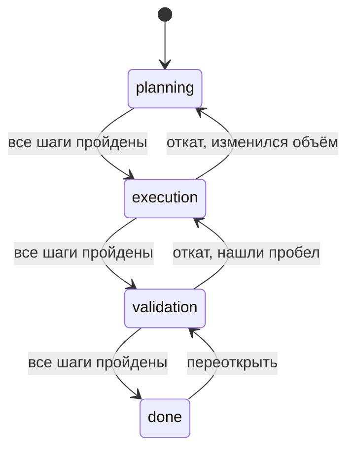

# day13 — состояние задачи как конечный автомат

Установка, ключи и команда запуска — в [корневом README](../README.md).

Тот же чат с профилем и тремя уровнями памяти, что в [`day12`](../day12/README.md), плюс формальное состояние задачи. Три вещи из задания получили по своему полю: **этап** — состояние автомата, **текущий шаг** — позиция внутри этапа, **ожидаемое действие** — что агент ждёт от пользователя на этом шаге. Состояние уходит отдельным блоком в каждый запрос, переход предлагает агент карточкой, допустимость проверяет код, а применяет пользователь.

Автомат живёт в [task.py](task.py) и устроен так, что двинуть его словами нельзя. Условие каждого шага выражено через рабочую память — через разделы ТЗ, которые наполняются только подтверждёнными пунктами. Поэтому «мы всё обсудили» не двигает ничего, а принятое требование двигает.

## Автомат



Четыре этапа, у каждого свои шаги, у каждого шага — ожидаемое действие и условие:

| Этап | Шаг | Ожидаемое действие | Условие перехода дальше |
| --- | --- | --- | --- |
| планирование | цель | назвать, что за сервис и зачем он нужен | в разделе `цель` не меньше 1 пункта |
| | требования | перечислить, что сервис должен делать | в разделе `требования` не меньше 2 пунктов |
| | ограничения | назвать сроки, объёмы и запреты | в разделе `ограничения` не меньше 1 пункта |
| исполнение | развилки | выбрать вариант на каждой развилке | в разделе `решения` не меньше 1 пункта |
| | детали | подтвердить решения по реализации | в разделе `решения` не меньше 3 пунктов |
| проверка | пробелы | убедиться, что в ТЗ не осталось пустых разделов | во всех четырёх разделах есть пункты |
| | приёмка | подтвердить, что ТЗ можно отдавать в работу | условия нет: закрывается подтверждением |
| готово | — | — | — |

Шаг отпускает вперёд, когда его условие выполнено. **Этап** отпускает вперёд, когда стоим на его последнем шаге и он закрыт — то есть каждый шаг пришлось пройти, а не просто оказаться в положении, где все условия случайно сошлись. Обратные рёбра условий не имеют: откат допустим всегда, потому что изменившийся объём задачи — это обычная её жизнь, а не поломка.

Два условия в таблице стоят особняком, и оба намеренно.

`приёмка` — единственный шаг без условия. «ТЗ можно отдавать в работу» — это решение, а не число пунктов, и выводить его из памяти было бы подлогом. Такой шаг закрывается тем, что на нём стоят: дойти до него можно только через все предыдущие.

`пробелы` смотрит назад, а не вперёд: к проверке все четыре раздела уже набраны прошлыми этапами, так что условие обычно выполнено ещё до входа в этап. Ловит он не новую работу, а потерю старой — пункт ТЗ удаляется крестиком в любой момент, и если удалить последнее ограничение, путь к `готово` закрывается обратно. Условия на пустоту раздела `вопросы` здесь нет специально: этот раздел наполняется только подтверждёнными пунктами, а открытые вопросы формулирует агент, так что раздел почти всегда пуст и условие на нём было бы декоративным.

## Guard строгий для всех

Недопустимый переход не применяется никогда: ни по предложению модели, ни по нажатию кнопки. Проверка одна и та же — `task.moves()` возвращает все переходы из текущего состояния вместе с причиной, по которой каждый закрыт, и по этому же списку рисуются кнопки в панели, отвечает `PUT /api/session/{id}/task` и отбраковываются предложения модели.

```
$ curl -X PUT .../task -d '{"stage": "execution"}'
{"detail": "Переход закрыт: шаг цель не последний в этапе, впереди ещё 2"}

$ curl -X PUT .../task -d '{"step": "требования"}'
{"detail": "Переход закрыт: не хватает: в разделе «цель» не меньше 1 пункта (сейчас 0)"}

$ curl -X PUT .../task -d '{"stage": "done"}'
{"detail": "Из этапа planning такого перехода нет"}
```

Строгий guard не запирает: любое условие снимается пополнением ТЗ, а ТЗ наполняет сам пользователь — карточками из day11 или руками. Отказ поэтому всегда называет, чего именно не хватает, а «нельзя» без причины не встречается ни в одном ответе.

Обратное тоже верно, и это оказалось важнее, чем ожидалось: **guard разрешает переход, а не требует его**. Условие может быть выполнено, а модель двигаться не предложит — и это правильное поведение, потому что число пунктов в разделе не знает, доволен ли ими человек. Разница между «можно» и «пора» остаётся за пользователем, и в замере ниже она измерена отдельной колонкой.

## Блок в запросе

Пятый системный блок, после профиля и памяти, вплотную к репликам:

```
system: Ты — ассистент, который помогает довести задачу до ТЗ...
system: Профиль пользователя — с кем ты говоришь и в каком виде он ждёт ответ...
system: Долговременная память — решения команды и знания о её окружении...
system: Рабочая память — техническое задание текущей задачи...
system: Состояние задачи — где идёт работа и чего ты ждёшь от пользователя...
user/assistant: последние 6 реплик дословно
user: новый вопрос
```

Порядок блоков идёт от неизменного к сиюминутному. Профиль — форма всего, что дальше. Память — что известно. Состояние — где работа сейчас, и это единственный блок, который меняется каждый ход, поэтому он стоит рядом с тем, на что отвечает:

```
Состояние задачи — где идёт работа и чего ты ждёшь от пользователя.
Этап и шаг двигаются переходами, а не твоим решением по ходу ответа: работай на текущем шаге и добивайся ожидаемого действия.
этап: планирование (1 из 4) — о чём задача и что от неё требуется
шаг: требования (2 из 3)
ожидаемое действие: перечислить, что сервис должен делать
шаг закроется, когда: в разделе «требования» не меньше 2 пунктов (сейчас 1)
следующий этап: исполнение — как это будет сделано
```

Условие уходит в модель словами и с текущим числом — иначе она предлагает двинуться вперёд, не понимая, чего для этого не хватает. В `SYSTEM_PROMPT` про блок сказано три вещи: работать на текущем шаге, не забегать вперёд этапа (на планировании не проектировать реализацию) и не объявлять переход самому — ни «переходим к исполнению», ни «задача готова». Объявление перехода — работа перехода.

## Кто двигает автомат

Отдельный модуль [progress.py](progress.py), по образцу [remember.py](remember.py): промпт, разбор JSON, никакого знания про базу и сеть. После ответа он получает состояние, ТЗ и список допустимых отсюда переходов — включая закрытые, вместе с причиной. Скрывать закрытые от модели значило бы получать предложения наугад: она всё равно назовёт следующий этап, но уже не понимая, чего для него не хватает.

```json
{"move": {"stage": "execution", "why": "требования и ограничения зафиксированы"}}
{"move": {"step": "ограничения", "why": "форматы отчёта названы"}}
{"move": null}
```

Дальше — та же политика, что у выдуманного значения шкалы в day12: перехода нет в графе или условие не выполнено → кандидат отбрасывается целиком и в очередь карточек не попадает. Отклонённые считаются и попадают в замер.

Разбор находок и разбор перехода — **два запроса по очереди**, а не один и не одновременно. Один запрос на оба вопроса плохо тем, что модель начинает двигать этап потому, что нашла что записать, и записывать потому, что решила двинуть этап. А порядок важен потому, что условие шага считается по ТЗ, а ТЗ пополняется как раз находками этого хода: спроси про переход одновременно с находками — и модель увидит «закрыто» там, где условие уже выполнено, и каждый шаг будет отставать на ход. Это было видно на первом же прогоне: с одновременными запросами автомат доходил только до середины исполнения, с последовательными — до `готово`. Пользователь в это время читает ответ, так что второй запрос ему не виден.

При выключенном автосохранении отставание на ход остаётся, и это не изъян разбора: пока пункт не записан, шаг и правда не закрыт, а записывает его пользователь кнопкой. Переход придёт следующим ходом — после решения, а не до.

Карточка перехода встаёт в ленте под ответом, рядом с находками памяти: «этап: планирование → исполнение», кнопки «Применить» и «Отклонить». У применённой «Отклонить» превращается в «Отменить» и возвращает прежнюю пару (этап, шаг) — прежнее значение запоминается в момент применения, а не находки, как `Proposal.previous` у шкалы в day12. Отмена идёт мимо графа намеренно: граф описывает, как задача движется, а отмена — признание, что предыдущего движения не было.

## Прогон: с блоком состояния и без него

Замеры ниже получены командой из корня проекта:

```bash
python day13/scenarios.py
```

Прогон идёт в отдельной временной базе и не попадает в историю приложения. Модель `deepseek-v4-flash`, лимит ответа 1200 токенов, окно 6 сообщений, профиль «Артём» — выбран по длине ответов: смотреть надо на переходы, а у профиля «подробно» каждый ход занимает полэкрана. Во время разговора решения принимает агент, и находки, и переходы: к кнопке в карточке прогон не пойдёт.

Один и тот же разговор из девяти реплик проходится дважды. **Автомат ведётся в обоих прогонах** — он в базе, а не в промпте, и `progress.py` в обоих видит состояние целиком. Различается ровно одно: попадает ли блок состояния в запрос, из которого агент пишет ответ. Поэтому разница между прогонами — это разница в ответах, а не в механике.

| Прогон | Переходов агентом | Осталось пользователю | Отброшено guard'ом | Дошли до | Судья |
| --- | --- | --- | --- | --- | --- |
| с блоком состояния | 7 | 0 | 0 | готово | 14/18 |
| без блока состояния | 5 | 2 | 0 | готово | 15/18 |

Судья — отдельная модель, которой дают этап, шаг, ожидаемое действие и ответ агента; она оценивает 0–2, работает ли ответ на текущем шаге и не забегает ли он вперёд этапа. Объявление перехода своими словами считается нарушением.

Разговор с блоком состояния:

| Ход | Реплика | Этап · шаг до хода | Ожидаемое действие | Переход | Судья |
| --- | --- | --- | --- | --- | --- |
| 1 | Нужен сервис выгрузки складских остатков: оператор … | планирование · цель | назвать, что за сервис и зачем он нужен | шаг: цель → требования | 2/2 |
| 2 | Сервис должен собирать отчёт за любой день и отдава… | планирование · требования | перечислить, что сервис должен делать | — | 2/2 |
| 3 | Ещё он должен присылать ссылку на готовый файл, ког… | планирование · требования | перечислить, что сервис должен делать | шаг: требования → ограничения | 2/2 |
| 4 | Ограничения: до 100 тысяч строк в отчёте, готовые ф… | планирование · ограничения | назвать сроки, объёмы и запреты | этап: планирование → исполнение | 2/2 |
| 5 | По развилке: собираем отчёт в фоне через Celery, си… | исполнение · развилки | выбрать вариант на каждой развилке | шаг: развилки → детали | 2/2 |
| 6 | Файлы кладём в S3-совместимое хранилище и отдаём по… | исполнение · детали | подтвердить решения по реализации | этап: исполнение → проверка | 2/2 |
| 7 | Отчёт собираем из отдельной read-реплики, чтобы выг… | проверка · пробелы | убедиться, что в ТЗ не осталось пустых … | — | 0/2 |
| 8 | По незакрытому: за прошлые дни отчёт считаем один р… | проверка · пробелы | убедиться, что в ТЗ не осталось пустых … | шаг: пробелы → приёмка | 0/2 |
| 9 | Всё сходится, ТЗ можно отдавать в работу. | проверка · приёмка | подтвердить, что ТЗ можно отдавать в ра… | этап: проверка → готово | 2/2 |
| контрольный | Может, добавим ещё выгрузку по складам целиком? | готово | начать новую задачу или вернуться к пра… | — | — |

Итог: за разговор 7 переходов по предложению агента, отброшено предложений 0, судья 14/18. Задача дошла до **готово**.

Разговор без блока состояния — те же реплики, тот же профиль:

| Ход | Реплика | Этап · шаг до хода | Ожидаемое действие | Переход | Судья |
| --- | --- | --- | --- | --- | --- |
| 1 | Нужен сервис выгрузки складских остатков: оператор … | планирование · цель | назвать, что за сервис и зачем он нужен | шаг: цель → требования | 1/2 |
| 2 | Сервис должен собирать отчёт за любой день и отдава… | планирование · требования | перечислить, что сервис должен делать | — | 2/2 |
| 3 | Ещё он должен присылать ссылку на готовый файл, ког… | планирование · требования | перечислить, что сервис должен делать | шаг: требования → ограничения | 2/2 |
| 4 | Ограничения: до 100 тысяч строк в отчёте, готовые ф… | планирование · ограничения | назвать сроки, объёмы и запреты | этап: планирование → исполнение | 0/2 |
| 5 | По развилке: собираем отчёт в фоне через Celery, си… | исполнение · развилки | выбрать вариант на каждой развилке | шаг: развилки → детали | 2/2 |
| 6 | Файлы кладём в S3-совместимое хранилище и отдаём по… | исполнение · детали | подтвердить решения по реализации | — | 2/2 |
| 7 | Отчёт собираем из отдельной read-реплики, чтобы выг… | исполнение · детали | подтвердить решения по реализации | — | 2/2 |
| 8 | По незакрытому: за прошлые дни отчёт считаем один р… | исполнение · детали | подтвердить решения по реализации | этап: исполнение → проверка | 2/2 |
| 9 | Всё сходится, ТЗ можно отдавать в работу. | проверка · пробелы | убедиться, что в ТЗ не осталось пустых … | — | 2/2 |
| контрольный | Может, добавим ещё выгрузку по складам целиком? | проверка · пробелы | убедиться, что в ТЗ не осталось пустых … | — | — |

Итог: за разговор 5 переходов по предложению агента, отброшено предложений 0, судья 15/18. После разговора условия остались выполненными ещё для 2 переходов, и до конца задачу довёл пользователь: шаг: пробелы → приёмка; этап: проверка → готово. Задача дошла до **готово**.

Замечания судьи в этом прогоне:

| Прогон | Ход | Этап · шаг | Оценка | Что не так |
| --- | --- | --- | --- | --- |
| с блоком состояния | 7 | проверка · пробелы | 0/2 | Ассистент занят уточнением доставки ссылки, а не проверкой пустых разделов ТЗ. |
| с блоком состояния | 8 | проверка · пробелы | 0/2 | Ассистент занят другим вопросом (доставка ссылки) и не проверяет пустые разделы ТЗ. |
| без блока состояния | 1 | планирование · цель | 1/2 | Ассистент не зафиксировал цель и назначение сервиса, а сразу ушёл в уточнения формата и способа формирования отчёта — это уже следующие шаги планирования. |
| без блока состояния | 4 | планирование · ограничения | 0/2 | Ассистент ушёл в тему доставки уведомлений вместо фиксации названных ограничений (сроки, объёмы, запреты). |

### Что из этого видно

**Автомат проходится целиком, и это главное.** `планирование → исполнение → проверка → готово`, семь переходов, ни одного отброшенного, у каждого перехода в журнале своя причина:

| № | Откуда | Куда | Кто | Почему |
| --- | --- | --- | --- | --- |
| 1 | планирование · цель | планирование · требования | агент | Цель названа: сервис выгрузки складских остатков с вы… |
| 2 | планирование · требования | планирование · ограничения | агент | Требования собраны: 3 пункта, включая доставку ссылки… |
| 3 | планирование · ограничения | исполнение · развилки | агент | Ограничения названы и зафиксированы в ТЗ — шаг планир… |
| 4 | исполнение · развилки | исполнение · детали | агент | Развилка по способу сборки закрыта: выбран фоновый ва… |
| 5 | исполнение · детали | проверка · пробелы | агент | Решения по реализации подтверждены: в разделе «решени… |
| 6 | проверка · пробелы | проверка · приёмка | агент | все разделы ТЗ заполнены, пробелы закрыты |
| 7 | проверка · приёмка | готово | агент | Пользователь подтвердил, что ТЗ можно отдавать в рабо… |

**Оценка судьи разошлась не в ту сторону, и объяснение у этого содержательное.** В прогоне с блоком состояния автомат уехал в проверку на ход раньше — на шестом, а не восьмом. Дальше пользователь по сценарию продолжал говорить про реализацию, а агент стоял на шаге «пробелы»: два хода из девяти он отвечал не про свой шаг и получил по 0/2. В прогоне без блока автомат отставал, шаг совпадал с репликой, и такой пары провалов не случилось — там 0/2 стоит один раз и по другой причине: агент сам ушёл с шага «ограничения» в тему уведомлений, хотя реплика была ровно про ограничения.

То есть судья наказал агента за расхождение между репликой пользователя и текущим шагом — за ровно ту ситуацию, для которой автомат и нужен. Ответы на этих ходах, если их прочитать, разумные: агент не бросает шаг, а держит его и тянет разговор к незакрытому.

> **Ход 7**, проверка · пробелы, ожидалось: убедиться, что в ТЗ не осталось пустых разделов
>
> — Отчёт собираем из отдельной read-реплики, чтобы выгрузка не мешала складу.
>
> — Это уже требование к источнику данных, зафиксирую. Но по доставке ссылки ответа пока нет: оператор получает её в интерфейсе или отдельным каналом?

**Прогон повторялся трижды, и разброс сравним с разницей.** Оценка судьи по трём парам прогонов: 17/18 против 14/18, 16/18 против 13/18 и 14/18 против 15/18 — дважды в пользу блока состояния, один раз против. На девяти ходах и одной модели-судье это значит, что блок состояния помогает держаться шага, но численно доказать это одним прогоном нельзя, и делать вид, что можно, не стоит.

**Ни одного отброшенного перехода за оба прогона.** Модель, которой показали список допустимых переходов вместе с причинами закрытия, невалидного не предлагает. Это ответ на вопрос, зачем нужен guard, если модель и так «понимает» этап, — и ответ неожиданный: guard тут работает не как фильтр, а как формулировка задачи. Список допустимых переходов в промпте и есть то, что не даёт модели изобретать своё; строгая проверка при этом остаётся, потому что второй источник переходов — кнопка в панели, а третий появится в тот момент, когда список из промпта уберут.

**Разница между «можно» и «пора» — не мелочь.** В прогоне без блока состояния два последних перехода агент так и не предложил, хотя условия для них были выполнены: он не считал, что «убедиться, что в ТЗ не осталось пустых разделов» сделано, — и по смыслу был прав, у него оставался открытый вопрос. Довёл задачу до `готово` пользователь, той же ручкой и с той же проверкой. Это не подпорка к замеру, а показ того, как автомат задуман: код отвечает за допустимость, модель предлагает, решает человек.

**`done` — состояние, а не подпись.** Контрольный ход задаётся, когда ТЗ уже собрано, и новое требование агент сам в объём не берёт:

> — Может, добавим ещё выгрузку по складам целиком?
>
> — Это новое требование к фильтрации отчёта, а не уточнение текущего. В ТЗ его пока нет — сформулируй, что именно должен выбирать оператор: только день или ещё и склад.

## Интерфейс

Панель состояния стоит первым блоком в колонке справа. Порядок здесь обратный порядку блоков в запросе, и это осознанно: в запросе первым идёт неизменное, а в панели — то, на что смотрят каждый ход.

Внутри блока сверху вниз: полоса из четырёх этапов с подсвеченным текущим и отмеченными пройденными; строка «Ожидаю от вас» с ожидаемым действием текущего шага; шаги этапа с галочками у пройденных и условием у текущего; кнопки допустимых переходов. Закрытые переходы не спрятаны, а погашены, и причина видна в подсказке — «нельзя» без причины выглядит как поломка. Откат нарисован пунктиром: он такое же ребро графа, но реже нужен.

В шапке к счётчикам добавилась пара `этап · шаг`, а в подсказке к ней — ожидаемое действие. Числа для состояния нет по той же причине, что и для профиля: оно уходит в запрос целиком и всегда. В панели диалогов рядом с именем профиля стоит этап, иначе непонятно, какая задача ещё планируется, а какая закрыта.

Строка состояния после хода досказывает судьбу автомата: сделанный переход, ждущее решения предложение или отброшенное с причиной. Отброшенное показывается наравне с принятым — иначе строгий guard выглядел бы как молчание модели.

«Автопрогон» печатает за пользователя девять реплик замера и на это время отдаёт решения агенту. Смотреть надо на панель состояния: полоса этапов проходит все четыре деления, а карточки переходов остаются в ленте с пометкой, кто их применил.

## Файлы

| Файл | Что в нём |
| --- | --- |
| [task.py](task.py) | автомат: этапы, шаги с условиями, граф переходов, guard, сборка системного блока |
| [progress.py](progress.py) | промпт предложения перехода и разбор ответа модели |
| [profile.py](profile.py) | модель профиля: шкалы со значениями, разделы, сборка системного блока |
| [memory.py](memory.py) | модель памяти: три уровня, разделы, сборка кадра запроса, окно |
| [remember.py](remember.py) | промпт классификации находок по трём адресам и разбор ответа модели |
| [seed.py](seed.py) | три профиля и долговременная память до начала общения |
| [shape.py](shape.py) | форма ответа в числах: слова, списки, таблицы, обращение, эмодзи |
| [agent.py](agent.py) | сборка запроса, состояние задачи, две очереди карточек, запись и переходы |
| [storage.py](storage.py) | SQLite: профили, реплики, ТЗ задачи, долговременные пункты, состояние и журнал переходов |
| [main.py](main.py) | API и SSE |
| [demo.py](demo.py) | реплики сценариев: одни и те же для кнопок и для замеров |
| [scenarios.py](scenarios.py) | оба прогона, из которых собран этот файл |
| [static/](static/) | страница чата с панелью состояния, блоком профиля, блоками памяти и карточками |

## API

Ниже — только новое и изменившееся; остальные ручки те же, что в [day12](../day12/README.md#api).

| Метод | Путь | Зачем |
| --- | --- | --- |
| `GET` | `/api/defaults` | параметры агента, разделы, шкалы, профили, **этапы автомата со шагами**, реплики прогонов |
| `PUT` | `/api/session/{id}/task` | перевести задачу: `{"stage": ...}` или `{"step": ...}`. `PUT`, потому что состояние у диалога одно, а не список. Недопустимый переход — 422 с причиной |
| `POST` | `/api/session/{id}/task/decision` | решение по карточке перехода: применить или отменить применённый |
| `GET` | `/api/session/{id}/transitions` | журнал переходов диалога: не «где задача», а «как она сюда пришла» |
| `GET` | `/api/session/{id}` | лента, профиль, состояние с шагами и переходами, блоки памяти, обе очереди карточек |

Состояние приходит целиком — вместе с шагами, их условиями и списком допустимых переходов. Считает его та же функция, которой сервер потом проверяет нажатие: второго места, где страница могла бы посчитать иначе, нет.

Кадры SSE в `/api/ask`: `prompt` — состав запроса до первого токена, включая этап и ожидаемое действие, безымянные кадры — куски ответа, `memory` — находки хода, предложенный или отброшенный переход и блоки после него, `done` — итог хода, `error` — ошибка вместо ответа.
