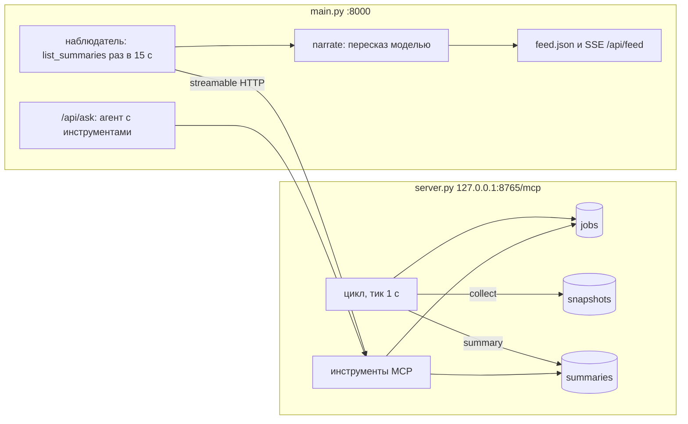

# day18 — планировщик и фоновые задачи

Установка, ключи и команда запуска — в [корневом README](../README.md).

В [`day17`](../day17/README.md) агент вызывал инструмент, когда его спрашивали. Здесь работа идёт и без вопроса: MCP-сервер по расписанию снимает состояние git этого репозитория, складывает снимки в SQLite и раз в период сводит их в агрегат, а веб-агент забирает каждую новую сводку и пересказывает её в ленту. Спросить агента по-прежнему можно, и тем же набором инструментов он меняет расписание: «собирай раз в 2 минуты» — это вызов `schedule_job`, а не настройка в коде.

## Почему сервер постоянный, а не stdio

В day17 сервер был подпроцессом клиента и жил ровно один запрос. Для планировщика это не подходит: расписание, которое останавливается вместе с соединением, никакое не расписание. Поэтому сервер — отдельный процесс на streamable HTTP (`http://127.0.0.1:8765/mcp`), а клиенты приходят к нему и уходят.

Фоновый цикл запускается в `lifespan` сервера. В SDK 2.2.0 при HTTP-транспорте lifespan входит один раз на процесс (менеджер сессий держит его на всё время работы), а не на каждую сессию, поэтому цикл один, сколько бы клиентов ни подключалось. Если сервер не запущен, клиент падает сразу, а не поднимает свой экземпляр с другим расписанием.



## Что лежит в SQLite

`day18/scheduler.db` создаётся при первом старте, вместе с двумя задачами по умолчанию: `collect` раз в минуту (первый снимок сразу — это точка отсчёта) и `summary` раз в 10 минут.

| Таблица | Что в ней |
| --- | --- |
| `jobs` | вид задачи, период (`NULL` — разовая), `next_run_at`, `last_run_at`, число запусков, последняя ошибка, активна ли |
| `snapshots` | время, HEAD, новые коммиты с прошлого снимка вместе с папками, которые они трогали, число грязных и неотслеживаемых файлов, объём незакоммиченных строк, папки с грязными файлами |
| `summaries` | период `(from, to]` и агрегат в JSON |

Время в базе хранится в UTC: строки ISO с одним смещением сравниваются как строки, и `next_run_at <= now` работает без разбора дат. Наружу уходит местное время, его читают человек и модель.

## Цикл планировщика

Раз в секунду цикл выбирает активные задачи, у которых наступил срок, и выполняет их в потоке (`asyncio.to_thread`): git и SQLite блокирующие, а цикл делит event loop с HTTP. После запуска `next_run_at` сдвигается на период от текущего момента, а разовая задача становится неактивной.

Два решения здесь не очевидны:

- **Пропущенное не догоняется.** Если сервер лежал час, минутный `collect` после старта выполнится один раз, а не шестьдесят: шестьдесят одинаковых снимков подряд ничего не добавят.
- **Сбой задачи — не сбой цикла.** Исключение записывается в `jobs.last_error`, задача переносится на следующий период, остальные работают дальше. Ошибку видно в `list_jobs` и в таблице расписания на странице.

Первый снимок — точка отсчёта: коммиты, сделанные до старта сервера, в сводки не попадают. Сводка честно считает только то, что сервер видел сам. Если прошлый HEAD исчез после rebase, новых коммитов в снимке просто нет, и это не ошибка.

## Инструменты

| Инструмент | Аргументы | Что делает |
| --- | --- | --- |
| `schedule_job` | `kind` — `collect` или `summary`, `every_minutes?` 1–1440, `delay_minutes?` 0–10080 | ставит периодическую, отложенную разовую или отложенную периодическую задачу |
| `list_jobs` | нет | активные задачи и пять последних завершённых |
| `cancel_job` | `job_id` | снимает задачу, история её запусков остаётся |
| `get_summary` | `hours` 1–168, по умолчанию 24 | агрегат снимков за окно по запросу, без сохранения |
| `list_summaries` | `after_id` ≥ 0, `limit` 1–50 | сохранённые сводки, самые новые `limit` штук после `after_id`, от старой к новой |

Периодическая задача того же вида заменяется, а не дублируется: «собирай раз в 2 минуты» меняет период существующего `collect` (в ответе `replaced: true`), а не ставит второй сбор рядом с первым. Разовые задачи копятся отдельно. Вызов без периода и без задержки — `ToolError`, как и отмена несуществующей или уже снятой задачи.

Агрегат сводки собирается из снимков за период:

- `snapshots` — сколько снимков попало в окно; ноль означает, что сбор не работал, и в агрегате появляется `note`;
- `commits` — число, авторы, папки и до двадцати последних коммитов без повторов;
- `working_tree` — первый и последний снимок, пик грязных файлов, папки с грязными файлами сейчас.

## Агент работает без страницы

Наблюдатель запускается в `lifespan` FastAPI и живёт, пока жив процесс. Раз в 15 секунд он подключается к серверу, берёт `list_summaries(after_id=последний виденный)`, отдаёт каждую новую сводку модели на пересказ и дописывает результат в `day18/feed.json`. Открытая вкладка только подписывается на ленту (`GET /api/feed`, SSE): закрыть её не значит остановить агента.

- **Соединение на каждый опрос**, а не одно на всё время. Сервер можно перезапустить, и следующий опрос просто подключится заново. Пока его нет, на странице горит «MCP-сервер недоступен» с причиной, а наблюдатель пробует снова.
- **Пересказ — один проход без инструментов.** Агрегат уже посчитан сервером, модель переводит JSON на человеческий и не может сходить за данными, которых в нём нет. Если модель не ответила, сводка всё равно попадает в ленту: с причиной и с агрегатом под катом.
- **Первый старт с пустой лентой** пересказывает только три последние сводки, а не всю историю.

## Прогон

Сервер поднят, клиент без модели показывает расписание и агрегат за час:

```
$ python day18/client.py
Соединение установлено за 59 мс
  адрес:       http://127.0.0.1:8765/mcp
  сервер:      AI Advent 18.0
  протокол:    2025-11-25
  возможности: experimental, prompts, resources, tools

Инструментов: 5
…
Вызов list_jobs()
  #1 collect  каждые 1 мин     активна, запусков 1, следующий 2026-09-23T14:24:17+03:00
  #2 summary  каждые 10 мин    активна, запусков 0, следующий 2026-09-23T14:33:17+03:00

Вызов get_summary(hours=1)
{"period": {…}, "snapshots": 1, "commits": {"count": 0, …}, "working_tree": {…}}
```

В чате — **«Собирай снимки раз в 2 минуты, а сводку делай каждую минуту»**. Два вызова, два раунда, `stop`:

```
schedule_job({"kind": "collect", "every_minutes": 2})  → id 1, каждые 2 мин, replaced: true
schedule_job({"kind": "summary", "every_minutes": 1})  → id 2, каждые 1 мин, replaced: true
```

Потом сервер перезапущен. Расписание пережило рестарт: задачи продолжили с прежними периодами и со своих `next_run_at`, без внеочередного запуска на старте. Наблюдатель переподключился сам, и в ленте через минуту появилось:

> **Сводка #3** · с 14:27:41 по 14:28:41 · снимков: 1
>
> За период коммитов не было. Рабочее дерево не изменилось: 12 изменённых файлов, 10 неотслеживаемых, 16 вставок и 3 удаления при HEAD 8ee4c5c. Изменения сосредоточены в папке day18 (10 файлов) и в корне (2 файла).

На вопрос **«Что происходило в репозитории за последний час?»** агент вызывает `get_summary(hours=1)` и отвечает по агрегату: четыре снимка, коммитов нет, HEAD всё время на `8ee4c5c`, незакоммиченные изменения в корне и `day18`.

## Интерфейс

Сверху — **Лента сводок**, новые первыми, с пересказом и агрегатом от сервера под катом; справа в шапке — состояние наблюдателя. Под ней — **Расписание**: задачи, следующий и последний запуск, число запусков и последняя ошибка. Таблица обновляется раз в 30 секунд, после каждой новой сводки и после вызова `schedule_job` или `cancel_job` из чата. Ниже — чат с готовыми вопросами, панель соединения и лента вызовов инструментов, как в day17.

## Файлы

| Файл | Что в нём |
| --- | --- |
| [server.py](server.py) | MCP-сервер на streamable HTTP: SQLite, цикл планировщика в lifespan, `collect` и `summary`, пять инструментов |
| [client.py](client.py) | MCP-клиент по HTTP: соединение, `call` для кода, перевод схем в формат запроса, CLI |
| [llm.py](llm.py) | DeepSeek: стрим с накоплением `tool_calls`, без изменений с day17 |
| [agent.py](agent.py) | ход в чате с циклом вызовов и `narrate` — пересказ одной сводки |
| [main.py](main.py) | наблюдатель в lifespan, `feed.json`, API и SSE |
| [static/](static/) | страница: лента сводок, расписание, чат |

`scheduler.db` и `feed.json` создаются при первом старте и в git не попадают.

## API

| Метод | Путь | Зачем |
| --- | --- | --- |
| `GET` | `/api/feed` | лента: кадр `status`, последние 50 кадров `item`, дальше новые по мере появления |
| `GET` | `/api/jobs` | расписание через `list_jobs` |
| `POST` | `/api/connect` | только соединение и список инструментов, без модели |
| `POST` | `/api/ask` | `{"prompt": "..."}` — ход целиком потоком |

Кадры `/api/ask` те же, что в day17: `mcp`, безымянные куски ответа, `tool`, `done`, `error`.
