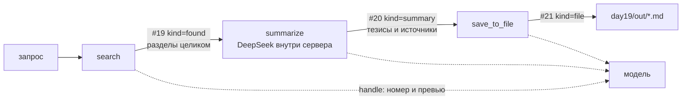

# day19 — композиция MCP-инструментов

Установка, ключи и команда запуска — в [корневом README](../README.md).

В [`day18`](../day18/README.md) инструменты работали по отдельности: один ставил задачу в расписание, другой отдавал сводку. Здесь их три и они выстроены в цепочку — `search` находит разделы документации проекта, `summarize` сводит их в тезисы, `save_to_file` пишет файл. Цепочка выполняется сама, одним вызовом `run_pipeline`, а те же три инструмента остаются доступны по одному — и видно, чем автоматический пайплайн отличается от цепочки, которую собирает модель.

Транспорт снова stdio, как в [`day16`](../day16/README.md) и [`day17`](../day17/README.md): расписания здесь нет, сервер нужен ровно на время запроса, и отдельный процесс для этого поднимать не за чем.

## Главное решение: данные ходят артефактами, а не текстом

Наивная цепочка выглядит так: модель зовёт `search`, получает текст, пересказывает его в аргументы `summarize`, получает сводку, копирует её в аргументы `save_to_file`. Данные на каждом шаге проходят через контекст модели, и она вправе их сократить, перефразировать или дописать. «Корректность передачи данных» в таком виде недоказуема: между шагами стоит генератор текста.

Поэтому каждый инструмент складывает результат в таблицу `artifacts` и возвращает **handle** — номер, превью и метрики. Следующий инструмент принимает `artifact_id` и читает payload из базы сам:

```python
# search вернул модели превью, а не тексты найденных разделов
"hits": [{"number": 1, "path": "day11/README.md", "heading": "API", "chars": 1476, "snippet": "…"}]
# summarize берёт полные тексты из артефакта, а не из аргументов вызова
row, found = _load(conn, artifact_id, "found", "summarize")
```

Модель передаёт только номера. Контракт держат три проверки в [server.py](server.py):

- **Вид звена.** `summarize` принимает только артефакт вида `found`, `save_to_file` — только `summary`. Чужой вид — `ToolError` с указанием нужного вида и инструмента, который его создаёт.
- **Целостность.** У артефакта хранится sha256 его payload, и перед использованием хеш пересчитывается. Payload и хеш считаются от одной и той же канонической формы JSON — иначе сравнение ловило бы порядок ключей, а не подмену.
- **Происхождение.** У артефакта есть `parent_id`, цепочка разворачивается до корня, и хеш проверяется у каждого звена. В сохранённый файл уходит вся цепочка с хешами: по файлу видно, из какого именно поиска он вырос.



## Инструменты

| Инструмент | Аргументы | Что делает |
| --- | --- | --- |
| `search` | `query`, `limit?` 1–10 | ищет разделы документации, отдаёт артефакт `found` с их текстами и превью в ответе |
| `summarize` | `artifact_id`, `max_bullets?` 3–10 | сводит разделы из артефакта в тезисы со ссылками на источники, отдаёт артефакт `summary` |
| `save_to_file` | `artifact_id`, `filename?` | пишет сводку в `day19/out`, отдаёт артефакт `file` с путём и хешем файла |
| `run_pipeline` | `query`, `limit?`, `filename?` | вся цепочка одним вызовом, с трассой шагов |
| `list_runs` | `limit?` 1–50 | последние прогоны с шагами: режим, времена, артефакты, ошибки |
| `get_artifact` | `artifact_id` | payload артефакта и его цепочка — чем именно шаги обменялись |

Описание инструмента модель читает из docstring, поэтому первая строка у трёх шагов начинается с номера («Шаг 1: …»), а дальше сказано главное: на входе номер артефакта, а не данные. Без этого модель охотно пересказывает найденное своими словами.

`search` ищет по документации самого проекта: `README.md` в корне, `dayN/README.md` и `dayN/TASK.md` — 37 файлов, 191 раздел. Корпус режется по заголовкам, заголовки внутри блоков с ``` не считаются заголовками (в README этого проекта есть блоки с markdown внутри). Индекс — FTS5 с `unicode61`, ранжирование `bm25` с весами: заголовок раздела вчетверо важнее текста. Переиндексация инкрементальная, по sha файла: правка одного README не перестраивает остальные 36.

Запрос человека переводится в выражение FTS5 не как есть: слова берутся в кавычки с префиксным `*`, иначе «AND» из текста стало бы оператором, а дефис — отрицанием. Сначала ищется совпадение по всем словам, и только если оно пустое — по любому. Стратегия видна в ответе (`"strategy": "все слова"`) и на странице: понятно, почему выдача широкая.

## Что в SQLite (`day19/index.db`)

| Таблица | Что в ней |
| --- | --- |
| `files`, `chunks` | корпус: sha файла и разделы в FTS5 |
| `artifacts` | `kind`, `parent_id`, payload в канонической форме JSON, sha256, размер |
| `runs` | запрос, режим (`auto` или `manual`), статус, времена |
| `steps` | шаг прогона: инструмент, `artifact_in`, `artifact_out`, статус, время, ошибка |

В `steps` пишут и `run_pipeline`, и одиночные вызовы: `search` открывает прогон с режимом `manual`, `summarize` и `save_to_file` находят его по корню цепочки своего артефакта. Форма записи у обоих режимов одна, поэтому их можно сравнивать таблицей.

Одна неочевидная деталь: прогон открывается отдельным соединением, а не тем же, в котором потом поднимается `ToolError`. Иначе транзакция откатывалась бы вместе с записью о неудачном шаге, и пустой поиск не попадал бы в историю вовсе — сбой, которого нет в журнале, выглядит как отсутствие сбоя.

## Автоматическое выполнение цепочки

`run_pipeline` проходит три шага сам и передаёт номера в коде:

```python
for position, tool in enumerate(PIPELINE, start=1):
    if tool == "search":
        handle = _search(query, limit, run_id)
    elif tool == "summarize":
        handle = await _summarize(artifacts["found"], 5, run_id)
    else:
        handle = _save(artifacts["summary"], filename, run_id)
```

Шаги видны по ходу, а не в конце: перед каждым и после каждого сервер отправляет progress-уведомление, клиент подписывается на них через `progress_callback` в `call_tool`. Своего поля для данных у уведомления в протоколе нет, поэтому кадр шага едет строкой JSON в `message` — единственный способ передать в нём что-то, кроме числа.

Сбой шага останавливает цепочку, но не превращается в отказ инструмента: в ответе трасса с `status: "failed"`, шагом, на котором всё встало, и причиной. Артефакты пройденных шагов остаются в базе, и цепочку можно продолжить с них руками.

```
run_pipeline({"query": "zzzqqqxxx"})
{"run_id": 9, "status": "failed", "failed_at": "search",
 "error": "По запросу 'zzzqqqxxx' в документации проекта ничего не нашлось. Разделов в индексе: 191.",
 "artifacts": {}, "steps": [{"position": 1, "tool": "search", "status": "failed", …}]}
```

`summarize` зовёт модель прямо на сервере, нестримовым вызовом: инструмент отдаёт результат целиком, показывать его по буквам некому. Клиент DeepSeek в [llm.py](llm.py) поэтому создаётся лениво — сервер живёт подпроцессом на stdio, и без ключа должен отказать инструмент, а не упасть весь процесс, который к этому моменту уже держит соединение.

## Две цепочки на одном запросе

Тумблер на странице переключает, кто держит номера артефактов. Один и тот же запрос «три уровня памяти агента», подряд:

| Режим | Кто композиция | Вызовов | Раундов модели | Время |
| --- | --- | --- | --- | --- |
| цепочкой | `run_pipeline` | 1 | 0 | 2,9 с |
| по шагам | агент | 3 | 4 | 7,2 с |

Работа инструментов в обоих прогонах одинаковая — `search` 13 и 12 мс, `summarize` 1741 и 1559 мс, `save_to_file` 2 и 4 мс. Разница только в раундах: в ручном режиме между шагами четыре раза ходили к модели, и это все четыре с лишним секунды. Ошибки в передаче данных при этом не случилось: модель аккуратно передала `artifact_id` 22 → 23 → 24 и ничего не пересказала — как раз потому, что пересказывать нечего, в ответе инструмента лежит номер.

Один побочный результат виден в папке `out`: автоматический прогон записал `три-уровня-памяти-агента.md`, а ручной — `tri-urovnya-pamyati-agenta.md`. Имя файла — единственное, что в ручном режиме придумывает модель, и она его транслитерировала, хотя её об этом не просили. Данные в цепочке от неё защищены, аргументы — нет, и разница между этими двумя вещами здесь ровно такая.

## Отказы, которые модель читает

Все три отказа — `ToolError`, то есть доезжают до модели текстом (разница с `ValueError` разобрана в [day16](../day16/README.md#ошибка-инструмента--это-тоже-ответ)):

| Вызов | Что получает модель |
| --- | --- |
| `summarize({"artifact_id": 999})` | `Артефакта #999 нет. Последний созданный артефакт — #18.` |
| `save_to_file({"artifact_id": 1})` | `Артефакт #1 — результат поиска (kind=found). Инструменту save_to_file нужен артефакт kind=summary — сводка, его создаёт summarize.` |
| `search({"query": "..."})` | `В запросе '...' нет слов для поиска.` |

Отказ по виду звена — главный: он превращает «модель перепутала номера» из тихой порчи данных в понятную ошибку. В чате на просьбу **«Вызови save_to_file для артефакта #1, имя файла проверка»** это выглядит так — один вызов, отказ, объяснение:

> Не получилось: артефакт #1 — это результат поиска (kind=found), а save_to_file принимает только сводку (kind=summary) от summarize.
>
> Нужно сначала прогнать summarize по артефакту #1, а затем сохранить полученный номер. Сделать это?

## Прогон из терминала

Клиент проходит цепочку целиком и печатает шаги по мере их выполнения — это те самые progress-уведомления:

```
$ python day19/client.py
Соединение установлено за 533 мс
  команда:     python server.py
  сервер:      AI Advent 19.0
  протокол:    2025-11-25
  возможности: experimental, prompts, resources, tools

Инструментов: 6
…
Вызов run_pipeline(query='как считаются токены и стоимость хода')
  1. search       пошёл
     готово за 11 мс: артефакт #25 (found), вход —
  2. summarize    пошёл
     готово за 2114 мс: артефакт #26 (summary), вход 25
  3. save_to_file пошёл
     готово за 2 мс: артефакт #27 (file), вход 26

Прогон #12: ok, 2132 мс
  1. search       — → 25     ok
  2. summarize    25 → 26    ok
  3. save_to_file 26 → 27    ok

Файл: day19/out/как-считаются-токены-и-стоимость-хода-2.md, 1895 байт
  sha256: 1c0d6b7dd62bcb56a1872e0ba45fe224074796f7d457b0e89cf618c390f69de5
```

Суффикс `-2` в имени — файл с таким именем уже был. Имя вообще приводится к slug, папки из него выбрасываются, а путь после `resolve()` обязан лежать внутри `out/`: инструмент, который пишет файлы по строке от модели, без этого превращается в запись куда угодно.

Что получилось в файле:

```markdown
# три уровня памяти агента

Сводка собрана пайплайном day19 2026-09-25T15:00:17+03:00, модель deepseek-v4-flash.

## Тезисы

- Три уровня памяти агента: рабочая память привязана к диалогу (`session_id`), долговременная — к базе, а уровень для каждой находки выбирает сам агент [1, 2].
…

## Источники

1. `day11/README.md` — «API»
2. `day11/README.md` — «Прогон: собираем ТЗ за 12 ходов»
…

## Цепочка

| Шаг | Артефакт | sha256 payload |
| --- | --- | --- |
| search | #19 | `f9ee82f5b010f768…` |
| summarize | #20 | `c49dfd35589280b7…` |
```

Ссылки в тезисах — номера фрагментов из поиска; их разбирает сервер и выбрасывает те, которых в выдаче не было. Сводка без ни одного тезиса — тоже отказ: значит, модель ответила не тем, о чём просили, и записывать такое в файл незачем.

## Интерфейс

Сверху — форма пайплайна: запрос, число разделов, имя файла и тумблер режима. Панель **Шаги** — три карточки, которые заполняются по ходу: статус, время, `запрос → артефакт #19` или `#19 → артефакт #20`, а под ними то, чем шаг обменялся со следующим — найденные разделы с размерами, тезисы со ссылками, путь и хеш файла. У каждой карточки есть «что в артефакте #N»: по нажатию страница забирает payload через `get_artifact` и показывает его целиком. Это и есть проверка передачи данных руками — видно, что во втором шаге лежит то же, что первый положил.

Панель **Результат** — путь, размер и sha256 файла с кнопкой «Показать файл». Ниже **Прогоны** — таблица из `list_runs`: номер, режим, запрос, шаги со временами, статус. Она обновляется после каждого прогона и после вызовов инструментов из чата. Ещё ниже — чат с агентом, панель соединения и лента вызовов, как в day17 и day18.

## Файлы

| Файл | Что в нём |
| --- | --- |
| [server.py](server.py) | индекс корпуса, артефакты, прогоны, шесть инструментов и `run_pipeline` |
| [client.py](client.py) | MCP-клиент по stdio: соединение, `call` с подпиской на прогресс, CLI с полным прогоном |
| [llm.py](llm.py) | DeepSeek: стрим для чата, `complete()` для `summarize`, ленивый клиент |
| [agent.py](agent.py) | ход агента с инструментами пайплайна и промптом про передачу номеров |
| [main.py](main.py) | `/api/pipeline` в двух режимах, прогоны, артефакты, файлы, чат |
| [static/](static/) | страница: форма, шаги, результат, прогоны, чат |

`index.db` и папка `out` создаются при первом запуске и в git не попадают.

## API

| Метод | Путь | Зачем |
| --- | --- | --- |
| `POST` | `/api/pipeline` | `{"query": "...", "limit": 5, "filename": null, "mode": "auto"}` — прогон потоком |
| `GET` | `/api/runs` | прогоны с шагами через `list_runs` |
| `GET` | `/api/artifacts/{id}` | payload артефакта и его цепочка |
| `GET` | `/api/files/{name}` | текст файла из `out`, имя без папок |
| `POST` | `/api/connect` | только соединение и список инструментов, без модели |
| `POST` | `/api/ask` | `{"prompt": "..."}` — ход агента целиком потоком |

Кадры `/api/pipeline` в режиме `auto`: `mcp` — рукопожатие, `step` — шаг из progress-уведомления, `pipeline` — трасса целиком, `error` — ошибка вместо прогона. В режиме `manual` кадры те же, что у `/api/ask`: `mcp`, безымянные куски ответа модели, `tool` на каждый вызов, `done` с раундами и `finish_reason`.
