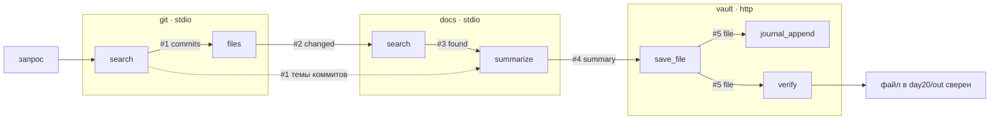

# day20 — реестр MCP-серверов и маршрутизация

Установка, ключи и команды запуска — в [корневом README](../README.md).

В [`day19`](../day19/README.md) сервер был один, а инструменты в нём — цепочкой. Здесь серверов три, и они разные по природе: [git](servers/git.py) знает историю репозитория, [docs](servers/docs.py) — документацию проекта, [vault](servers/vault.py) — хранилище отчётов с журналом. У каждого свой транспорт, своя база и свой жизненный цикл; общего между ними нет ничего, и знает обо всех только [registry.py](registry.py).

Сценарий дня — длинный флоу на семь шагов, который проходит по всем трём серверам: найти в истории коммиты по теме → узнать, какие папки они трогали → найти документацию именно в этих папках → свести в тезисы → записать файл → занести в журнал → сверить хеш на диске. Флоу выполняется двумя способами — по контракту в коде и моделью — и оба прогона проверяются одной и той же проверкой порядка.

## Главное решение: артефакты держит оркестратор

В day19 инструменты передавали друг другу номера артефактов через общую таблицу — это работало, потому что сервер был один и таблица была его. У трёх независимых серверов общей базы нет, и наивный путь ровно один: выдачу git модель пересказывает в аргументы docs, сводку docs — в аргументы vault. Данные снова идут через генератор текста, и «корректность маршрутизации» опять недоказуема.

Поэтому артефакты переехали на уровень выше — в реестр. Каждый ответ инструмента целиком ложится в `orchestration.db`, модель получает **handle**: номер, вид, sha256, размер, превью и подсказку, кому этот артефакт годится:

```json
{"artifact_id": 8, "kind": "commits", "kind_title": "коммиты", "server": "git",
 "sha256": "de7085a27ab148de…", "bytes": 491,
 "preview": {"query": "day11 memory", "strategy": "все слова", "count": 1, "commits": [{"short": "4501746", "subject": "Add day11 chat UI with three separate memory tiers…"}]},
 "next": "передай {\"$from\": 8} в git__files(commits) или docs__summarize(context)"}
```

В аргументах модель пишет ссылку `{"$from": 8}`, а реестр разворачивает её перед отправкой на сервер. Серверы про артефакты не знают вовсе — они получают настоящие данные и остаются самостоятельными. Что чем можно кормить, объявлено в реестре, отдельно от серверов:

```python
NEEDS: dict[str, dict[str, Need]] = {
    "git__files": {"commits": Need("commits", "hashes", "хеши коммитов из выдачи поиска или журнала")},
    "docs__search": {"paths": Need("changed", "filter", "папки, которые трогали коммиты", optional=True)},
    "docs__summarize": {
        "sections": Need("found", "hits", "найденные разделы вместе с их текстом"),
        "context": Need("commits", "subjects", "темы коммитов", optional=True),
    },
    …
}
```

Из одного этого объявления получается всё остальное:

- **Схема для модели.** Реестр переписывает `input_schema` инструмента: на месте ref-аргумента остаётся объект `{"$from": N}` с `additionalProperties: false`. Данные в такой аргумент просто не пролезают — не потому, что сервер их не примет, а потому, что модель их не может туда положить.
- **Контракт звена.** `sections` принимает только `found`, `body` — только `summary`. Чужой вид — отказ маршрутизатора, до сервера вызов не доходит.
- **Целостность и происхождение.** У артефакта хранится sha256 канонической формы JSON, и перед подстановкой хеш пересчитывается. Родителей у артефакта может быть несколько — сводка выросла и из найденных разделов, и из тем коммитов, — поэтому происхождение разворачивается до корня по всем ветвям, с проверкой хеша у каждой.
- **Запись в журнале.** Подстановка попадает в `routes` с точностью до поля: `{"arg": "sections", "artifact_id": 10, "field": "hits", "sha256": "3cd85f17…", "bytes": 9881}`. Видно, что 9881 байт найденных разделов доехали до `summarize`, ни разу не побывав в контексте модели.



## Три сервера, три роли, два транспорта

| Сервер | Транспорт | Живёт | База | Инструменты |
| --- | --- | --- | --- | --- |
| `git` | stdio | подпроцесс на время запроса | нет, источник — сам репозиторий | `search`, `log`, `show`, `files` |
| `docs` | stdio | подпроцесс на время запроса | `docs.db` — FTS5 по документации | `search`, `read_section`, `summarize` |
| `vault` | streamable HTTP, `127.0.0.1:8770` | постоянный процесс, запускается отдельно | `vault.db` — журнал записанного | `save_file`, `read_file`, `list_files`, `journal_append`, `journal_list`, `verify` |

Транспорт выбран по роли, а не для разнообразия. git и docs нужны ровно на время запроса, и поднимать под них процессы заранее не за чем — как в [day16](../day16/README.md) и [day17](../day17/README.md). У vault есть состояние, которое обязано переживать запросы: журнал записанного. Поэтому он живёт отдельным процессом со своим терминалом и подключается по HTTP — как сервер с расписанием в [day18](../day18/README.md).

Соединения открываются по очереди и в одной задаче: транспорты MCP держат внутри себя группы задач anyio, а те привязаны к задаче, которая их открыла, — параллельный `TaskGroup` разваливается на закрытии стека. Постоянный сервер проверяется до транспорта, обычным TCP-подключением с таймаутом в секунду, иначе обрыв всплывает группой исключений уже посреди чужого ответа. Недоступный сервер не мешает остальным — он остаётся в реестре с причиной:

```
vault  http  http://127.0.0.1:8770/mcp
  http://127.0.0.1:8770/mcp не отвечает (ConnectionRefusedError).
  Запустите python day20/servers/vault.py
```

Без vault каталог сжимается до 7 инструментов, страница помечает сервер серым, а CLI отказывается начинать флоу: шагов 5–7 в нём всё равно нет. Модель в чате при этом продолжает работать с git и docs — реестр отдаёт ей только то, что действительно на связи.

Ещё одна деталь про stdio: логи такого сервера уходят в stderr клиента. На уровне INFO там оказывались и запросы к модели из `summarize`, и ожидаемые отказы инструментов (`Tool 'search' failed: …` — это SDK, а не сбой), вперемешку с выводом флоу. Поэтому у git и docs `log_level="WARNING"`, а у vault уровень остался прежним: у него свой терминал, и там каждый запрос и каждая запись в хранилище кстати.

## Каталог: имена с префиксом сервера

Инструменты трёх серверов складываются в один каталог под квалифицированными именами `сервер__инструмент` — это то, что видит модель. Разделитель `__`, потому что точка в именах функций у OpenAI-совместимого API недопустима.

```
В каталоге инструментов: 13
  одноимённые: search — git__search, docs__search

Каталог
  git__search              → commits
  git__files               → changed  commits=$from commits
  docs__search             → found    paths=$from changed?
  docs__summarize          → summary  sections=$from found, context=$from commits?
  vault__save_file         → file     body=$from summary
  vault__verify            → check    expect=$from file
  …
```

Имя `search` занято дважды, и это сделано нарочно: два сервера с похожими задачами — самый частый случай коллизии. Реестр разбирает имя от модели так:

| Что пришло | Как разрешилось |
| --- | --- |
| `docs__search` | `qualified` — префикс есть, инструмент есть, вызов уходит на docs |
| `summarize` | `resolved` — голое имя однозначно, единственный владелец найден |
| `search` | отказ `collision` — владельцев двое, реестр не угадывает |
| `docs__find` | отказ `unknown_tool` со списком инструментов сервера |
| `gitt__search` | отказ `unknown_server` со списком серверов |

Голое однозначное имя маршрутизируется, голое одноимённое — нет. Угадывать «наверное, имелся в виду docs» здесь хуже, чем отказать: ошибка выбора сервера тихо даёт не тот ответ, а отказ модель читает и исправляет за один раунд.

На практике до коллизии дело почти не доходит: в каталоге лежат уже квалифицированные имена, и модель их и зовёт. На просьбу **«Позови search по теме „уровни памяти агента“»** она сама выбрала git (тема про историю) и, получив пустую выдачу, предложила выбрать сервер:

> Поиск по git ничего не дал: коммитов со словами «уровни», «памяти», «агента» нет (всего 27 коммитов, темы латиницей — про day17–day19 и MCP).
>
> Уточните: искать в истории коммитов (git__search, лучше латинскими словами) или в документации (docs__search)?

## Инструменты

| Инструмент | Аргументы | Что делает |
| --- | --- | --- |
| `git__search` | `query`, `limit?` | ищет коммиты по словам в сообщениях: хеш, дата, автор, тема |
| `git__log` | `limit?` | последние коммиты без поиска |
| `git__show` | `ref` | один коммит целиком: статистика и файлы |
| `git__files` | `commits` ← `commits` | что трогали эти коммиты: файлы, папки, дни и готовый фильтр папок |
| `docs__search` | `query`, `paths?` ← `changed`, `limit?` | разделы документации по запросу, с фильтром по папкам |
| `docs__read_section` | `path`, `heading` | текст одного раздела |
| `docs__summarize` | `query`, `sections` ← `found`, `context?` ← `commits`, `max_bullets?` | тезисы со ссылками на источники и готовый markdown отчёта |
| `vault__save_file` | `name`, `body` ← `summary` | пишет отчёт в `day20/out`, отдаёт путь, размер и хеш |
| `vault__read_file` | `name` | текст файла из хранилища |
| `vault__list_files` | — | что лежит в `out` |
| `vault__journal_append` | `entry` ← `file`, `note?` | запись о файле в журнал, он переживает перезапуск |
| `vault__journal_list` | `limit?` | журнал хранилища |
| `vault__verify` | `expect` ← `file` | сверяет sha256 файла на диске с ожидаемым и ищет его в журнале |

Стрелка `←` — это ref-аргумент: туда уходит `{"$from": N}`, а не данные.

`docs__search` ищет по документации самого проекта — `README.md` в корне, `dayN/README.md` и `dayN/TASK.md`: 39 файлов, 204 раздела, FTS5 с `unicode61` и `bm25`, заголовок вчетверо важнее текста, переиндексация инкрементальная по sha файла. Устройство индекса разобрано в [day19](../day19/README.md#инструменты), здесь к нему добавился фильтр по папкам — тот самый, который приезжает ссылкой от `git__files`.

Кто решает, что считать «папками, которые трогали коммиты», — сервер git, а не реестр: в артефакте `changed` есть готовое поле `filter` (дни, а если коммиты их не трогали — всё, кроме корня). Реестр только переносит поле в аргумент и не понимает его смысла — иначе знание о предметной области расползлось бы из серверов в маршрутизатор.

## Длинный флоу: семь шагов

Контракт лежит в [flow.py](flow.py) списком шагов — инструмент, вид артефакта, зачем он здесь и как собрать аргументы:

| # | Инструмент | Ссылки на вход | Артефакт | Зачем |
| --- | --- | --- | --- | --- |
| 1 | `git__search` | — | `commits` | что в истории делали по этой теме |
| 2 | `git__files` | `#1.hashes` | `changed` | какие папки трогали эти коммиты |
| 3 | `docs__search` | `#2.filter` | `found` | разделы документации в этих же папках |
| 4 | `docs__summarize` | `#3.hits`, `#1.subjects` | `summary` | тезисы по разделам с темами коммитов рядом |
| 5 | `vault__save_file` | `#4.markdown` | `file` | отчёт файлом в `day20/out` |
| 6 | `vault__journal_append` | `#5.entry` | `entry` | запись в журнал хранилища |
| 7 | `vault__verify` | `#5.check` | `check` | sha256 файла на диске против артефакта |

Порядок здесь не декоративный: `git__files` нечего делать без хешей от `git__search`, `docs__search` без папок от `git__files` ищет по всему проекту, а сводить и записывать нечего, пока не найдены разделы. Инструмент `search` встречается дважды и на разных серверах — сначала у git, потом у docs, — так что «правильный порядок» включает и правильный выбор владельца имени.

Шаг 7 замыкает флоу: `verify` считает хеш файла на диске и сравнивает его с тем, что положил в артефакт `save_file`. Совпало — значит, текст сводки дошёл от docs до диска байт в байт, и это проверка не по журналу оркестратора, а по файловой системе третьего сервера.

Контракт служит двум делам: по нему флоу выполняется в режиме `flow` и по нему же проверяется прогон в режиме `agent`. Сравнивать есть с чем, потому что оба режима ходят через один `registry.dispatch` и пишут один журнал.

## Прогон из терминала

Клиент здоровается со всеми серверами, печатает каталог и проходит флоу, показывая шаги по ходу:

```
$ python day20/client.py "уровни памяти агента day11"
Реестр MCP-серверов

  git    stdio  python servers/git.py  (273 мс)
    AI Advent git 20.0, протокол 2025-11-25
    подпроцесс на время запроса
    инструменты: search, log, show, files
…
  vault  http   http://127.0.0.1:8770/mcp  (31 мс)
    AI Advent vault 20.0, протокол 2025-11-25
    постоянный процесс, запускается отдельно
    инструменты: save_file, read_file, list_files, journal_append, journal_list, verify

Длинный флоу по запросу 'уровни памяти агента day11'
  1. git__search            пошёл — что в истории репозитория делали по этой теме
     готово за 61 мс: аргументы запроса → артефакт #1 (commits)
  2. git__files             пошёл — какие папки трогали эти коммиты
     готово за 32 мс: commits ← #1.hashes → артефакт #2 (changed)
  3. docs__search           пошёл — разделы документации в этих же папках
     готово за 15 мс: paths ← #2.filter → артефакт #3 (found)
  4. docs__summarize        пошёл — тезисы по разделам с темами коммитов рядом
     готово за 2461 мс: sections ← #3.hits, context ← #1.subjects → артефакт #4 (summary)
  5. vault__save_file       пошёл — отчёт файлом в day20/out
     готово за 4 мс: body ← #4.markdown → артефакт #5 (file)
  6. vault__journal_append  пошёл — запись в журнал хранилища, он переживает перезапуск
     готово за 4 мс: entry ← #5.entry → артефакт #6 (entry)
  7. vault__verify          пошёл — sha256 файла на диске против артефакта — флоу замыкается
     готово за 3 мс: expect ← #5.check → артефакт #7 (check)

Прогон #1: ok, 2586 мс

Проверка порядка
  контракт:  git__search → git__files → docs__search → docs__summarize → vault__save_file → vault__journal_append → vault__verify
  как вышло: git__search → git__files → docs__search → docs__summarize → vault__save_file → vault__journal_append → vault__verify
  серверы:   git → docs → vault
  порядок совпал, совпало 7 из 7, вызовов 7, отказов реестра 0

Файл: day20/out/уровни-памяти-агента-day11.md, 2570 байт
  sha256: f5afa4f52e9f50aa3af2701ea6228555c3cf2ce0c810a0a8e967fae04aeb600e
  сверка на диске: сошлось
  в журнале хранилища: есть
```

Из 2,6 секунды прогона 2,5 — это `summarize` с моделью внутри сервера. Остальные шесть шагов вместе занимают около 120 мс: маршрутизация, подстановка ссылок и проверка хешей на этом фоне не видны.

## Проверка порядка

Проверка считается по журналу маршрутов, а не по коду флоу: берётся список получившихся вызовов и сравнивается с контрактом через `difflib.SequenceMatcher`. Из опкодов получается три списка — совпало, пропустили, лишнее, — плюс отказы, сбои, коды причин и порядок серверов. Отсюда же видно, что маршрутизация именно межсерверная: `git → docs → vault`.

Сбой шага останавливает флоу, но не прячет его. Запрос, у которого в истории нет ни одного коммита (сообщения в этом репозитории латиницей):

```
$ python day20/client.py "гейты между этапами задачи"
Длинный флоу по запросу 'гейты между этапами задачи'
  1. git__search            пошёл — что в истории репозитория делали по этой теме
     failed: Коммитов со словами гейты, между, этапами, задачи в истории нет. Всего коммитов: 27,
     последние темы: Add day19 with a chain of MCP tools that, … Если тема запроса по-русски,
     ищи по латинским словам из неё или возьми последние коммиты инструментом git__log.

Прогон #2: failed, 62 мс

Проверка порядка
  как вышло:
  серверы:   git
  порядок отклонился, совпало 0 из 7, вызовов 1, отказов реестра 0
  не позвали: git__search, git__files, docs__search, docs__summarize, vault__save_file, …
```

Отказ инструмента здесь не просто «ничего не нашлось»: в нём сказано, сколько коммитов есть всего, как выглядят последние темы и что делать дальше — искать латиницей или взять `git__log`. Это адресовано модели: в режиме `agent` она по такому тексту выправляет запрос сама, а не ходит по кругу до потолка раундов.

## Два режима на одном запросе

Тумблер на странице переключает, кто выбирает инструменты и держит номера артефактов. Один и тот же запрос «уровни памяти агента day11», подряд:

| Режим | Кто выбирает инструменты | Вызовов | Раундов модели | Время | Порядок |
| --- | --- | --- | --- | --- | --- |
| контрактом | код `flow.py` | 7 | 0 | 2,6 с | совпал |
| агентом | модель | 7 | 8 | 15,5 с | совпал |

Работа инструментов в обоих прогонах одинаковая — 2,6 и 2,8 секунды на все семь вызовов, почти всё это `summarize`. Разница в раундах: агент семь раз ходил к модели между шагами, и это все тринадцать лишних секунд. Порядок модель при этом выстроила сама и не перепутала владельца имени `search`: сначала git, потом docs.

Ошибки в передаче данных не случилось ни в одном режиме, и это видно в журнале маршрутов — у каждого вызова записаны подставленные ссылки с хешами:

```
5  agent  vault__save_file  qualified  ok  13 мс
   refs: [{"arg": "body", "artifact_id": 11, "kind": "summary", "field": "markdown",
           "sha256": "634d38a6ddfbe…", "bytes": 2751}]
```

А вот что модель всё-таки придумала сама — имя файла. Контракт записал `уровни-памяти-агента-day11.md`, агент — `day11-memory-tiers-report.md`, и заметку в журнале он тоже сочинил свою. Ровно та же граница, что и в day19: данные в флоу от модели защищены, аргументы — нет, и по журналу видно, какие поля пришли ссылкой, а какие из головы.

## Отказы, которые модель читает

До сервера такой вызов не доходит: маршрутизатор отказывает сам, кладёт в журнал код причины и отдаёт модели текст.

| Вызов | Что получает модель | Причина |
| --- | --- | --- |
| `search(query=…)` | `Инструмент 'search' есть у нескольких серверов: git__search — …; docs__search — …. Позови нужный полным именем.` | `collision` |
| `docs__find(query=…)` | `У сервера docs нет инструмента 'find'. Есть: read_section, search, summarize.` | `unknown_tool` |
| `gitt__search(…)` | `Сервера 'gitt' в реестре нет. Есть: docs, git, vault.` | `unknown_server` |
| `git__files(commits=["4501746"])` | `Аргумент 'commits' инструмента git__files принимает только ссылку вида {"$from": N} на артефакт вида commits — коммиты, его создаёт git__search или git__log. Последний такой артефакт — #8. Данные через себя не переписывай — их подставит реестр.` | `inline` |
| `docs__summarize(sections={"$from": 1})` | `Артефакт #1 — коммиты (kind=commits), а аргументу 'sections' инструмента docs__summarize нужен артефакт вида found — разделы документации, его создаёт docs__search. Последний такой артефакт — #10.` | `wrong_kind` |
| `vault__save_file(body={"$from": 999})` | `Артефакта #999 нет. Последний созданный артефакт — #14.` | `no_artifact` |
| `vault__save_file(name=…)` | `Инструменту vault__save_file нужен аргумент 'body' — ссылка {"$from": N} на артефакт вида summary — сводка, его создаёт docs__summarize. Последний такой артефакт — #11.` | `missing_arg` |

Ещё четыре причины сюда же: `offline` — сервер не на связи, `no_field` — в артефакте нет поля, которое объявлено в контракте, `corrupt` — sha256 артефакта не сошёлся при подстановке, `bad_arguments` — аргументы от модели не разобрались как JSON. В отказах про ссылки всегда назван последний подходящий номер артефакта: это превращает «модель ошиблась ссылкой» в задачу с готовым ответом.

Отказ `inline` — главный из новых. Модель, которая привыкла подставлять данные, первым делом попробует переписать выдачу поиска в аргумент — и получит не тихую порчу данных, а объяснение, что так нельзя и что данные подставят за неё.

## Что в SQLite

Баз три, и это не случайность: у каждого сервера своя, у оркестратора своя, общей нет ни у кого.

| База | Таблица | Что в ней |
| --- | --- | --- |
| `orchestration.db` | `runs` | прогон: запрос, режим (`flow`, `agent`, `chat`), статус, времена, вердикт проверки порядка |
| | `artifacts` | `kind`, `parents`, payload в канонической форме JSON, sha256, размер, кто создал |
| | `routes` | маршрут вызова: что просили, куда ушло, как разрешилось имя, подставленные ссылки, время, отказ |
| `docs.db` | `files`, `chunks` | корпус документации: sha файла и разделы в FTS5 |
| `vault.db` | `journal` | что записано в `out`: путь, размер, sha256, заметка |

`routes` — это и есть журнал маршрутизации: в нём одинаково лежат вызовы из флоу, из агента и из чата, поэтому режимы сравнимы, а проверка порядка у них одна. Отказ маршрутизатора попадает туда же — с кодом причины вместо способа разрешения имени.

## Интерфейс

Сверху — **Серверы**: карточка на каждый, с транспортом, адресом, версией, временем рукопожатия и списком инструментов; недоступный сервер показывает причину и подсказку, чем его поднять. Ниже **Каталог инструментов** — все 13 с владельцем, видом артефакта и ref-аргументами; одноимённые подсвечены.

Форма флоу — запрос, число разделов, тезисов, имя файла и тумблер «контрактом / агентом». Панель **Шаги** заполняется по ходу: инструмент с префиксом сервера, время, `commits ← #1.hashes → артефакт #2`, а под ними — то, чем шаг обменялся дальше: коммиты, папки, найденные разделы с размерами, тезисы, путь и хеш файла. У каждой карточки есть «что в артефакте #N» — страница забирает payload и цепочку целиком, и передачу данных можно проверить руками.

Дальше **Проверка порядка** — контракт против того, что вышло, с совпадениями, пропусками, лишними вызовами и порядком серверов; **Отчёт** — путь, размер, sha256, результат сверки на диске и сам текст файла; **Журнал маршрутизации** — таблица из `routes` со всеми вызовами, ссылками и отказами. Внизу — чат с агентом над тем же каталогом: лента вызовов и ответ, как в day17–day19.

## Файлы

| Файл | Что в нём |
| --- | --- |
| [servers/git.py](servers/git.py) | сервер над историей репозитория: поиск по коммитам, журнал, коммит, файлы и папки |
| [servers/docs.py](servers/docs.py) | сервер над документацией: индекс FTS5, поиск с фильтром по папкам, чтение раздела, сводка моделью |
| [servers/vault.py](servers/vault.py) | постоянный сервер-хранилище на HTTP: файлы в `out`, журнал, сверка хешей |
| [registry.py](registry.py) | реестр: соединения, объединённый каталог, разрешение имён, ссылки `$from`, артефакты и журнал маршрутов |
| [flow.py](flow.py) | контракт длинного флоу, его выполнение и проверка порядка вызовов |
| [agent.py](agent.py) | ход агента над каталогом трёх серверов: префиксы, ссылки, потолок раундов |
| [llm.py](llm.py) | DeepSeek: стрим для чата, `complete()` для `summarize`, ленивый клиент |
| [client.py](client.py) | CLI: рукопожатие со всеми серверами, каталог, длинный флоу с печатью шагов |
| [main.py](main.py) | `/api/flow` в двух режимах, реестр, журнал, артефакты, файлы, чат |
| [static/](static/) | страница: серверы, каталог, флоу, проверка порядка, журнал, чат |

`orchestration.db`, `docs.db`, `vault.db` и папка `out` создаются при первом запуске и в git не попадают.

## API

| Метод | Путь | Зачем |
| --- | --- | --- |
| `POST` | `/api/flow` | `{"query": "...", "limit": 5, "bullets": 5, "name": null, "mode": "flow"}` — длинный флоу потоком |
| `POST` | `/api/ask` | `{"prompt": "..."}` — ход агента целиком потоком |
| `GET` | `/api/contract` | контракт флоу: шаги, серверы, виды артефактов |
| `GET` | `/api/servers` | реестр: серверы, каталог, коллизии имён |
| `GET` | `/api/runs` | последние прогоны с маршрутами и вердиктом |
| `GET` | `/api/routes` | журнал маршрутизации: последние вызовы всех режимов вместе с отказами |
| `GET` | `/api/artifacts/{id}` | payload артефакта и его происхождение |
| `GET` | `/api/files/{name}` | текст файла из `out`, имя без папок |

Кадры `/api/flow` в режиме `flow`: `mcp` — рукопожатие со всеми серверами и каталог, `step` — шаг до и после вызова, `flow` — трасса с вердиктом, `error` — ошибка вместо прогона. В режиме `agent` кадры те же, что у `/api/ask`: `mcp`, безымянные куски ответа модели, `call` на каждый вызов, `done` с раундами и вердиктом.
