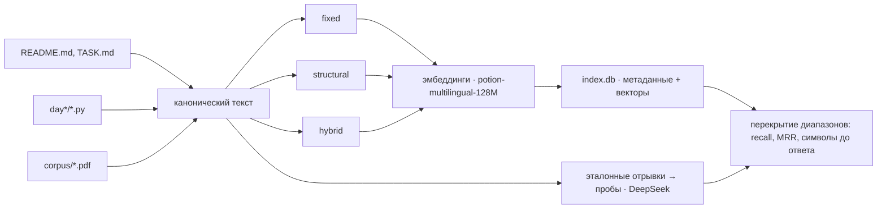

# day21 — индексация документов и сравнение стратегий chunking

Установка, ключи и команды запуска — в [корневом README](../README.md).

В [`day19`](../day19/README.md) и [`day20`](../day20/README.md) поиск по документации работал на FTS5: слово из запроса должно было встретиться в тексте, иначе раздел не находился. Здесь у индекса другая природа — эмбеддинги, — и вместе с ней появляется вопрос, которого у полнотекстового поиска нет: **чем считать единицу поиска**. FTS5 индексировала раздел, потому что так вышло; вектору всё равно, что ему дали, и от размера куска зависит всё.

Поэтому день не про «сделать индекс» — индекс тут собирается за шесть секунд, — а про то, как доказать, что одно разбиение лучше другого. Стратегий три, набор эталонов один, и главный вывод оказался не про chunking.

## Главное решение: эталон задан диапазоном символов, а не номером чанка

Сравнить две стратегии «в лоб» нельзя: они режут текст по-разному, и «правильный чанк» у них — разный объект. Нумерация тоже не помогает, потому что чанк №7 в `fixed` и чанк №7 в `structural` не имеют между собой ничего общего.

Поэтому эталон живёт на уровне, где стратегий ещё нет. Каждый документ приводится к одному **каноническому тексту**, и дальше весь пайплайн говорит смещениями в нём:

- чанк — это диапазон `[start, end)`;
- эталон — тоже диапазон `[start, end)`, отрывок в две-четыре фразы;
- попадание — чанк из того же файла накрыл не меньше половины эталонного отрывка.



Отрывки нарочно короткие и начинаются в случайном месте документа. Если бы эталоном был раздел, его границы совпадали бы с границами `structural`, и сравнение доказывало бы само себя.

У канонического текста есть следствие, которое видно в работе. Файлы репозитория живут и меняются, а смещения к ним привязаны, поэтому у пробы хранится ещё и sha документа вместе с самим отрывком. Изменился файл — отрывок ищется в новом тексте заново; не нашёлся — проба выбывает с записью в отчёт. В последнем прогоне это сработало дважды:

```
* day21/corpus.py изменился, отрывок переехал на 1851
* day21/scenarios.py изменился, отрывок переехал на 975
```

Считать метрики по съехавшим эталонам молча — худшее из возможного: числа получаются, а значат они не то.

## Корпус: документация, код и PDF

| Источник | Файлов | Символов | Страниц |
| --- | --- | --- | --- |
| документация | 42 | 311 507 | 173 |
| код | 143 | 1 538 008 | 854 |
| **всего** | **185** | **1 849 515** | **1028** |

Это `README.md` в корне, `dayN/README.md` и `dayN/TASK.md`, весь `dayN/**/*.py` и всё, что лежит в [corpus/](corpus/) — задание просило 20–30 страниц, репозиторий даёт тысячу.

Корпус включает и сам `day21`, так что этот файл в него тоже входит. Числа в таблицах ниже — с конкретного прогона, и с каждой правкой документации они немного едут; на выводы это не влияет, потому что выводы держатся на кратных разницах, а не на третьем знаке.

PDF кладёт в папку человек, и пайплайн разбирает их через `pypdf`. Здесь же обнаружилась разница между «PDF» и «текстом»: отсканированный учебник на 160 страниц даёт ровно ноль символов, потому что внутри картинки. Промолчать в таком случае нельзя — файл положили в папку и ждут его в индексе:

```
Мимо корпуса: day21/corpus/scanned.pdf: текстового слоя нет — похоже на скан, из него нужен OCR
```

## Три стратегии

| Стратегия | Что режет | Границы |
| --- | --- | --- |
| `fixed` | фиксированный размер | окно 400 токенов, перекрытие 80, структура игнорируется |
| `structural` | по структуре | markdown — заголовки `#`–`###`, Python — верхнеуровневые `def`/`class`, PDF — страницы |
| `hybrid` | структура с потолком и полом | то же, но раздел длиннее 400 токенов режется внутри себя, короче 60 — склеивается с соседом |

Третья добавлена сверх минимума задания, и она здесь не для количества: у `structural` есть патология, которую иначе не видно.

Под именем `structural` работают три разных парсера, и это не усложнение ради общности — у markdown, кода и PDF просто нет общей идеи границы. Заголовки markdown разбираются с учётом заборов ``` , потому что в README этого проекта есть блоки с markdown внутри, и без них разделы рвались бы по примерам. Код разбирается через `ast`, а границей объявления считается не строка `def`, а первая строка комментария над ним: в этом проекте там лежит объяснение, зачем функция нужна, и отрывать его от кода — значит выбрасывать самое осмысленное.

Ни одна стратегия не теряет текст: соседние чанки стыкуются встык, и каждый символ документа попадает ровно в один чанк (в `fixed` — минимум в один, из-за перекрытия). Исключение одно — огрызки структуры короче 40 символов в `structural`, и это её честная цена, а не оплошность.

## Цена индекса

| Стратегия | Чанков | Медиана, ток. | p95 | Максимум | Чанкинг | Эмбеддинг | Векторы |
| --- | --- | --- | --- | --- | --- | --- | --- |
| `fixed` | 1786 | 400 | 401 | 405 | 5.2 с | 0.5 с | 1.83 МБ |
| `structural` | 1687 | 172 | 891 | **15 493** | 1.3 с | 0.2 с | 1.73 МБ |
| `hybrid` | 2228 | 260 | 401 | 402 | 3.6 с | 0.3 с | 2.28 МБ |

Вся история `structural` в одной клетке: максимум 15 493 токена. Это `class Agent` из [day15/agent.py](../day15/agent.py) — один структурный элемент, который автор не делил, потому что делить его по смыслу нечего. Для вектора это катастрофа: `model2vec` усредняет эмбеддинги токенов, и пятнадцать тысяч токенов, сведённые в 256 чисел, перестают значить что-либо конкретное. У `hybrid` тот же класс разрезан на части с сохранением имени раздела — `class Agent · часть 3`.

Обратное тоже правда: медиана `structural` — 169 токенов, вдвое меньше `fixed`. Разделы в этом корпусе в основном короткие, а редкие гиганты тянут p95 до 891.

Эмбеддинги считаются за 0.2–0.4 секунды на весь корпус, и это не опечатка. `model2vec` — статические эмбеддинги: вместо прогона трансформера просмотр таблицы векторов и усреднение. Чанкинг в этом пайплайне дороже эмбеддингов в десять раз, и дороже всего в нём — подсчёт токенов токенайзером.

## Сравнение: три способа спросить одно и то же

Здесь пайплайн и показал то, чего от него не ждали. У каждого эталонного отрывка три пробы: короткий поисковый запрос, вопрос на естественном языке и сам отрывок. Третья — не вопрос, а потолок: она измеряет индекс в отрыве от того, умеет ли модель связать формулировку с текстом ответа.

**recall@5, 119 эталонов, top-5:**

| Стратегия | поисковый запрос | вопрос | эталонный отрывок (потолок) |
| --- | --- | --- | --- |
| `fixed` | 0.23 | 0.23 | 0.78 |
| `structural` | 0.28 | 0.27 | 0.72 |
| `hybrid` | 0.28 | 0.23 | **0.84** |

Разрыв между последней колонкой и первыми двумя — 0.55 — и есть главный результат дня. Индекс, разбиение, метаданные и диапазоны работают: отрывком текста нужный чанк находится в четырёх случаях из пяти. Вопросом о том же самом отрывке — в одном из четырёх. Разница целиком на стороне модели: статические эмбеддинги сопоставляют формулировки, а не смысл. Вопрос «Сколько стоит короткий диалог из трёх ходов с учётом заголовка диалога?» задан по разделу «Короткий диалог: 3 хода» из [day8/README.md](../day8/README.md), а внутри раздела — таблица замеров со строками вида `| 3 | 4 | 364 | 256 | 235 | 599 | 487 (+33.8%) | $0.000181 | $0.000377 |`. Слов, общих с вопросом, там почти нет, а усреднённый вектор такой таблицы не значит ни «стоит», ни «ход».

Этот вывод стоило добывать отдельной пробой, потому что без неё низкий `recall` списался бы на chunking, который тут не при чём.

## Где chunking всё-таки решает: цена ответа

Критерий попадания по перекрытию сам по себе выгоден большим чанкам — накрыть эталон легче тому, кто тащит больше текста. Поэтому рядом с `recall` обязана стоять вторая колонка: сколько символов пришлось бы прочитать до первого попадания.

**Проба — эталонный отрывок, там где индекс работает в полную силу:**

| Стратегия | recall@1 | recall@3 | recall@5 | MRR@5 | Символов до ответа |
| --- | --- | --- | --- | --- | --- |
| `fixed` | 0.53 | 0.71 | 0.78 | 0.62 | 2 953 |
| `structural` | 0.45 | 0.63 | 0.72 | 0.55 | 5 169 |
| `hybrid` | 0.52 | **0.75** | **0.84** | 0.64 | **2 185** |

Вот здесь стратегии расходятся по-настоящему. `hybrid` находит больше и платит за это вдвое меньше текста, чем `structural`: 2 185 символов против 5 169. Причина — та же клетка с 15 493 токенами: когда `structural` угадывает файл, он приносит вместе с ответом весь класс целиком.

На поисковых запросах картина та же по деньгам, хотя `recall` у всех троих в пределах шума: `hybrid` — 3 641 символ до ответа, `fixed` — 5 272, `structural` — 5 596. То есть при равном качестве `hybrid` дешевле на треть, и это единственная разница, которую на этом корпусе можно считать значимой.

Разница в `recall` между `0.23` и `0.28` — это шесть попаданий из 119, и выдавать её за превосходство `structural` было бы честнее не делать. А вот полуторакратная разница в объёме контекста устойчива и объясняется механикой, а не выборкой.

## Разбиения рядом

На странице есть панель, где одна полоса — текст документа, а блоки на ней — чанки каждой стратегии. Разницу видно без чисел: у `structural` четыре широких блока, у `hybrid` — восемь ровных.

Кроме того, у каждого чанка в выдаче открывается карточка со всеми метаданными:

```
файл         day8/README.md
документ     day8 — токены и стоимость
раздел       токены 0–400
источник     документация
диапазон     0–1 361, 1 361 символов, 400 токенов
sha256       6a365e3c1b21bd9ef4ac74c264ce2b99…
соседи       #43 токены 0–400   #44 токены 320–720
```

Соседи здесь не украшение: по ним видно, что перекрытие в `fixed` действительно есть — чанк №43 кончается на токене 400, а №44 начинается с 320.

## Что в SQLite

Одна база, четыре таблицы, 23 МБ на три индекса.

| Таблица | Строк | Что в ней |
| --- | --- | --- |
| `indexes` | 3 | прогон сборки: стратегия, параметры, модель, размерность, статистика размеров, времена, байты векторов |
| `documents` | 185 | `path`, `source`, `title`, `sha256` и канонический текст целиком |
| `chunks` | 5 701 | метаданные чанка и `vector BLOB` — 256 чисел `float32` в одной строке с ними |
| `probes` | 120 | пробы с эталонным диапазоном, отрывком и sha документа |

Отдельного векторного хранилища здесь нет намеренно. Вся матрица одной стратегии — около двух мегабайт; она читается из SQLite за 35 мс, дальше живёт в памяти, и поиск по ней — перемножение матрицы на вектор запроса: **0.2 мс**. ANN, IVF и HNSW решали бы на таком объёме задачу, которой нет, — точный ответ дешевле любого приближения к нему.

Канонический текст документов лежит в базе не для удобства: по нему восстанавливается контекст чанка и заново ищутся эталонные отрывки, когда файл на диске успел измениться.

Колонки называются `start_char` и `end_char`, потому что `end` в SQLite — ключевое слово, и `ORDER BY end` разбирается как начало выражения `CASE`.

## Прогон из терминала

```
$ python day21/scenarios.py build
## Корпус

| Источник | Файлов | Символов | Страниц |
| --- | --- | --- | --- |
| документация | 42 | 311 507 | 173 |
| код | 143 | 1 538 008 | 854 |
| **всего** | **185** | **1 849 515** | **1028** |

Индексация: 185 документов, модель minishlab/potion-multilingual-128M

  fixed        1786 чанков, чанкинг   5.2 с, эмбеддинг   0.5 с, векторы 1.83 МБ
  structural   1687 чанков, чанкинг   1.3 с, эмбеддинг   0.2 с, векторы 1.73 МБ
  hybrid       2228 чанков, чанкинг   3.6 с, эмбеддинг   0.3 с, векторы 2.28 МБ
```

Шаги разделены по тому, что им нужно. `build`, `compare` и `search` работают без ключа и без сети: эмбеддинги локальные, набор проб лежит в файле. Ключ DeepSeek нужен только шагу `probes`, который эти пробы придумывает, — и его результат коммитится, чтобы сравнение воспроизводилось, а не пересчитывалось заново.

```bash
python day21/scenarios.py            # корпус, индексы, сравнение
python day21/scenarios.py probes     # заново придумать 120 проб, нужен ключ
python day21/scenarios.py search "инкрементальная переиндексация по sha файла"
```

## Файлы

| Файл | Что в нём |
| --- | --- |
| [corpus.py](corpus.py) | сбор документации, кода и PDF в канонические тексты; страницы PDF, отчёт о том, что не попало |
| [chunking.py](chunking.py) | три стратегии, `Chunk` с метаданными, парсеры markdown / `ast` / страниц |
| [embed.py](embed.py) | `model2vec`: ленивая загрузка, батчи, нормировка L2, токенайзер для размеров чанков |
| [index.py](index.py) | схема `index.db`, запись векторов блобами, матрица в памяти, поиск top-k |
| [evaluate.py](evaluate.py) | пробы моделью, зачёт по перекрытию диапазонов, метрики и сравнение |
| [scenarios.py](scenarios.py) | CLI: корпус, сборка, пробы, сравнение, поиск — сразу в markdown |
| [llm.py](llm.py) | DeepSeek: только `complete()`, только для генерации проб |
| [main.py](main.py) | сборка потоком, поиск по трём индексам, чанк с метаданными, сравнение |
| [static/](static/) | страница: корпус, индексы, поиск, границы чанков, карточка чанка, сравнение |
| [probes.json](probes.json) | 120 проб с эталонами — коммитится ради воспроизводимости |

`index.db` и PDF из `corpus/` в git не попадают. Модель — 512 МБ — кешируется в `~/.cache/huggingface` при первом запуске и больше не скачивается; из кеша она поднимается за 3 секунды.

## API

| Метод | Путь | Зачем |
| --- | --- | --- |
| `GET` | `/api/state` | корпус, что не попало в него, собранные индексы, набор проб |
| `POST` | `/api/build` | сборка трёх индексов потоком: кадры `start`, `building`, `built`, `done` |
| `POST` | `/api/search` | `{"query": "...", "limit": 5}` — один вектор запроса во все индексы |
| `GET` | `/api/chunk/{id}` | чанк целиком: текст, метаданные, соседи по документу |
| `GET` | `/api/documents` | документы индекса с числом чанков |
| `GET` | `/api/document` | документ и границы чанков в нём по каждой стратегии |
| `POST` | `/api/compare` | сравнение по готовому набору проб, без модели |

Модели в запросах страницы нет ни одной: эмбеддинги считает локальная `model2vec`, поиск — numpy, сравнение — готовый набор проб.

## Что дальше

Упираться в chunking на этом корпусе больше некуда: потолок держит модель, а не разбиение. Следующий шаг — не третья стратегия, а либо эмбеддинги, которые обучены на парах «вопрос — ответ», либо гибридный поиск, где вектор работает вместе с FTS5 из [day19](../day19/README.md): лексика хорошо ловит имена `AgentRegistry` и `sse_frame`, по которым вектор промахивается, а вектор — формулировки, которых в тексте нет дословно.
