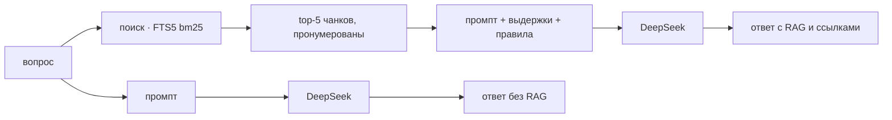

# day22 — первый RAG-запрос: ответ с базой и без неё

Установка, ключи и команды запуска — в [корневом README](../README.md).

[`day21`](../day21/README.md) собрал индекс и доказал, что разбиение выбрано верно. Здесь из индекса наконец достают ответ: вопрос идёт в поиск, найденные чанки пристёгиваются к вопросу, всё вместе уходит в модель. Рядом тот же вопрос уходит к той же модели без единого чанка, и два ответа стоят друг против друга.

Сравнение режимов — простая часть дня. Сложной оказалась та, с которой он начинался: поиск, на котором всё держится, пришлось менять, и не на тот, на который собирались.

## Главный вывод: гибрид проиграл чистой лексике

day21 закончился планом: «гибридный поиск, где вектор работает вместе с FTS5». Основание было: на вопросе человека вектор находил нужный чанк в 23 случаях из ста, а на отрывке того же текста — в 84. Статические эмбеддинги сопоставляют формулировки, а не смысл, и имена вроде `sse_frame` для них не значат ничего — а лексика берёт их буквально.

План выполнен, оба индекса собраны, списки объединены по RRF. Результат на тех же 119 эталонных отрывках day21:

**Проба — вопрос на естественном языке, top-5:**

| Ретривер | recall@1 | recall@3 | recall@5 | MRR@5 | Символов до ответа |
| --- | --- | --- | --- | --- | --- |
| `vector` | 0.08 | 0.18 | 0.23 | 0.13 | 4 468 |
| `lexical` | **0.40** | **0.55** | **0.66** | **0.49** | **2 686** |
| `hybrid` | 0.21 | 0.34 | 0.42 | 0.28 | 3 933 |

Лексика подняла recall@5 с 0.23 до 0.66 — втрое, — и это ровно то, чего от неё ждали. А объединение оказалось хуже лучшего из того, что объединяло.

Причина механическая. RRF складывает места: `score = Σ 1/(60 + место)`. Голос у обоих списков равный, а качество — нет, и слабый ретривер не добавляет к сильному, а тащит его вниз: чанк, который лексика поставила первым, уезжает на третье место, потому что вектор о нём не знает, зато наверх поднимается то, что вектор нашёл по созвучию.

Приглушить голос вектора не помогает. При весе `0.1` против `1.0` recall@5 поднимается до 0.68 — на две пробы из 119, — а recall@1 падает с 0.40 до 0.32 и MRR с 0.49 до 0.44. Для RAG это обмен в минус: верхние чанки занимают контекст целиком, и место важнее присутствия.

Потолок объединения виден прямо, если посчитать, кто что находит:

| | отрывков из 119 |
| --- | --- |
| нашли оба | 23 |
| нашла только лексика | 55 |
| нашёл только вектор | **5** |
| не нашёл никто | 36 |

Вектор приносит пять отрывков, которых лексика не видит. Даже идеальное объединение дало бы 0.70 против её 0.66 — четыре пробы, — и платить за них местами в выдаче не стоит. Поэтому под RAG здесь стоит `lexical`, а `vector` и `hybrid` остались в коде и на странице: вывод нужно было получить, и он нужен рядом с числами, а не вместо них.

### Где у этого вывода слабое место

Вопросы в наборе day21 придумывала модель по отрывку текста. Ей было велено не цитировать дословно, но общая лексика с отрывком у такого вопроса остаётся, и лексическому поиску это льстит. Человек, который не видел отрывка, спрашивает другими словами.

Поэтому второй набор — десять вопросов, написанных руками, — здесь не только про качество ответов. Он же независимая проверка выбора: на нём лексика довела до нужного файла **все десять из десяти**, включая те, где формулировка вопроса с текстом источника не совпадает.

## Два режима отличаются одним блоком

Модель одна, температура одна, системный промпт один, вопрос дословно тот же. В режиме `rag` перед вопросом встаёт блок выдержек и три правила. Если бы режимы отличались ещё чем-нибудь, сравнение показывало бы разницу промптов.



Выдержка приходит в контекст с путём и разделом в шапке — `[1] day21/README.md · Что в SQLite`. Номер не украшение: им модель ссылается на источник, и по нему же ссылка разворачивается обратно в путь к файлу. Так появляется колонка «ответ сослался», которой иначе не было бы вовсе.

Третье правило — про отказ. Без него модель, получив пять нерелевантных чанков, пересказывает ближайший, и выходит ответ, который выглядит подкреплённым и при этом неверен. Это хуже отказа и хуже честного незнания. У правила есть цена, и она ниже измерена.

## Контрольный набор: десять вопросов, написанных руками

Набор лежит в [questions.json](questions.json) и коммитится. У каждого вопроса записаны ожидание прозой, список обязательных фактов и список источников:

```json
{
  "id": 5,
  "kind": "в базе",
  "question": "На каком порту слушает постоянный MCP-сервер хранилища в day20?",
  "expect": "На 127.0.0.1:8770, эндпоинт /mcp. Это единственный сервер day20, который запускают отдельным процессом…",
  "facts": ["8770"],
  "sources": ["day20/README.md", "README.md", "day20/registry.py", "day20/servers/vault.py"]
}
```

Руками — потому что ожидание должен задавать тот, кто знает ответ. И потому что десять вопросов от человека ловят то, чего не поймают сто двадцать от модели: формулировку, не подсмотренную в тексте.

Вопросы трёх типов, и третий тип важен не меньше первого:

| Тип | Сколько | Зачем |
| --- | --- | --- |
| `в базе` | 6 | ответ есть в корпусе и больше нигде: без поиска модель его знать не может |
| `общий` | 2 | ответ можно дать и без базы — проверка, что RAG не мешает |
| `вне базы` | 2 | ответа в корпусе нет — проверка на отказ вместо выдумки |

В списке источников перечислены **все** файлы, по которым на вопрос можно ответить, а не самый очевидный. Неполный список штрафовал бы поиск за верную выдачу: про порт хранилища одинаково верно отвечают и README day20, и сам `vault.py`.

Набор проверяет сам себя. `python day22/scenarios.py check` ищет каждый обязательный факт в названных источниках и ругается, если не нашёл. Без этого набор тихо протухает: документацию правят, число в ней меняется, а в `questions.json` остаётся прежнее — и оба режима получают ноль за ответ, который верен.

## Что показало сравнение

| Режим | Факты | Источник найден | Ответ сослался | Судья, 0–2 | На 2 балла | Отказы «вне базы» | Токенов запроса |
| --- | --- | --- | --- | --- | --- | --- | --- |
| без RAG | 0.26 | 0.00 | 0.00 | 0.90 | 4 из 10 | 2 из 2 | 124 |
| с RAG | **0.81** | **1.00** | **0.88** | **1.60** | **6 из 10** | 2 из 2 | 1 742 |

Средние по набору честны, но скрывают главное: три типа вопросов дали три разных ответа, и один из них — не в пользу RAG.

| Тип | Вопросов | судья без RAG | судья с RAG | факты без RAG | факты с RAG |
| --- | --- | --- | --- | --- | --- |
| `в базе` | 6 | 0.17 | **1.67** | 0.10 | **0.83** |
| `общий` | 2 | **2.00** | 1.00 | 0.75 | 0.75 |
| `вне базы` | 2 | 2.00 | 2.00 | — | — |

**На вопросах из базы разрыв десятикратный**, и это ожидаемо: фактов вроде номера порта или имени модели эмбеддингов нет нигде, кроме этого репозитория. Интереснее, как именно проигрывает режим без RAG. Он не говорит «не знаю» — он отвечает уверенно и мимо:

```
Вопрос: На каком порту слушает постоянный MCP-сервер хранилища в day20?

без RAG   В day20 постоянный MCP-сервер хранилища слушает на порту 8765.
с RAG     На порту 8770 [1].
```

8765 — это порт `day18`. Ответ правдоподобен ровно настолько, чтобы его не перепроверили.

**На общих вопросах RAG проиграл, и это цена третьего правила.** Вопрос «почему у нормированных векторов косинус совпадает со скалярным произведением» модель знает и так; без контекста она выводит это из формулы и получает у судьи 2. С контекстом правило «отвечай только по выдержкам» превращает объяснение в цитату: «векторы сразу нормируются по L2, поэтому косинусная близость — это просто скалярное произведение [1]» — верно, подкреплено, но на вопрос «почему» не отвечает. Судья ставит 1.

Так работает любой RAG со строгим правилом: он меняет общую эрудицию на проверяемость. Для базы знаний по проекту это верный размен, и всё же знать его цену надо.

**На вопросах вне базы — ничья, 2:2.** Обе колонки отказались: `rag` заданной формулировкой, обычный режим своими словами. Выдумать лицензию проекта `deepseek-v4-flash` не захотел ни с контекстом, ни без. Ничья здесь — хороший результат: она означает, что контекст из пяти нерелевантных чанков не спровоцировал пересказ ближайшего.

Отдельно стоит колонка **«ответ сослался» — 0.88**. Восемь случаев из девяти, где источник был найден, ответ на него действительно опирается. Девятый — вопрос про отличие FTS5 от эмбеддингов: ответ верный, выдержки в контексте есть, а ссылки нет ни одной. Проверять эту колонку надо отдельно от «источник найден», потому что иначе такой ответ считался бы подкреплённым, хотя написан он по памяти.

## Чем мерили и почему двумя линейками

Механика считается без модели и не плавает между прогонами: доля обязательных фактов в тексте ответа, дошёл ли поиск хоть до одного годного файла, сослался ли ответ на такой файл номером. Числа при сверке нормализуются — «15 493» в документации и «15493» в ответе один и тот же факт.

Судья нужен там, где механика слепа. Факт можно перечислить и не ответить; можно ответить верно другими словами. Судья видит вопрос, ожидание и ответ — но не знает режима и не видит контекста, иначе он оценивал бы полноту контекста, а не ответа.

Расходятся они предсказуемо и полезно. Вопрос про day14 — единственный, где с RAG факты `0.00`, а судья `1`: ответ верно описал обрыв на полуслове другими словами, и обязательное слово в него просто не попало. Механика это засчитать не может и не должна; для того рядом и стоит вторая колонка.

«Источник найден» — величина бинарная, а не доля. Ответить хватает одного верного файла, и требовать всех сразу значило бы штрафовать поиск за то, что он поставил README day20 выше, чем `vault.py`, хотя порт написан в обоих.

## Цена контекста

| | без RAG | с RAG |
| --- | --- | --- |
| Токенов запроса, в среднем | 124 | 1 742 |
| Токенов ответа | 75 | 64 |
| Время ответа | 1.46 с | 1.09 с |
| Время поиска | — | 12–34 мс |

Запрос подорожал в **14 раз**. Это и есть вся экономика RAG: модель не менялась, промпт не менялся, платим за то, что к вопросу пристёгнуты пять чанков.

Ответ при этом стал короче и быстрее — не парадокс, а следствие: с готовыми выдержками модели нечего рассуждать вслух и не за чем оговариваться. Поиск на фоне модели бесплатен: 12–34 мс против секунды с лишним.

## Что в SQLite

Одна база, 11.5 МБ, два индекса по одним и тем же чанкам.

| Таблица | Строк | Что в ней |
| --- | --- | --- |
| `index_info` | 1 | прогон сборки: параметры, модель, размеры чанков, времена, байты векторов |
| `documents` | 185 | `path`, `source`, `title`, `sha256` и канонический текст целиком |
| `chunks` | 2 229 | метаданные чанка и `vector BLOB` — 256 чисел `float32` в одной строке с ними |
| `chunks_fts` | 2 229 | FTS5 поверх `section`, `title`, `text` |

FTS5 заведена таблицей внешнего содержимого: свою копию текста она не держит, а читает её из `chunks` по `content_rowid`. Две копии двух мегабайт текста — это не про место, а про то, что рано или поздно они разъедутся. Платить за это приходится явной перестройкой после сборки — `INSERT INTO chunks_fts (chunks_fts) VALUES ('rebuild')`, — и она стоит 0.04 секунды на весь корпус.

Запрос человека переводится в выражение FTS5 префиксными термами: `unicode61` русской морфологии не знает, «индексация» и «индексации» для него разные слова, а `"индексаци"*` покрывает обе. Термы объединяются через `OR`, а не `AND`: вопрос на естественном языке почти никогда не входит в чанк всеми словами. Отсев при этом не теряется — его делает `bm25`, которому редкое слово весит больше частого, а имя раздела вчетверо больше тела.

| Чанков | Медиана, ток. | p95 | Макс. | Чанкинг | Эмбеддинг | FTS5 | Векторы |
| --- | --- | --- | --- | --- | --- | --- | --- |
| 2 229 | 261 | 401 | 402 | 3.9 с | 0.3 с | 0.04 с | 2.28 МБ |

Чанков столько же, сколько у `hybrid` в day21, с точностью до одного: разбиение то же, а разошлись они ровно на строку, которую этот день дописал в корневой README. Хорошая проверка того, что перенос ничего не сломал.

## Корпус без самого себя

| Источник | Файлов | Символов | Страниц |
| --- | --- | --- | --- |
| документация | 42 | 312 896 | 174 |
| код | 143 | 1 538 008 | 854 |
| **всего** | **185** | **1 850 904** | **1028** |

Числа в таблицах этой страницы — с конкретного прогона. Корпус включает корневой README, который этот же день и правит, поэтому они немного едут от прогона к прогону; на выводы это не влияет, потому что выводы держатся на кратных разницах, а не на третьем знаке.

day21 индексировал в том числе сам себя и правильно делал. Здесь папка `day22` из корпуса исключена, и дело не только в README с разбором ответов. Докстринги модулей этого дня объясняют принятые решения числами — «15 493 токена», «recall@5 0.23», — то есть ровно теми фактами, которые контрольные вопросы и проверяют. Это обнаружилось на первом же прогоне: поиск принёс в контекст `day22/chunking.py` вместо `day21/README.md`. Оставь так — и колонка «ожидаемые источники» перестала бы значить что-либо, а RAG отвечал бы по шпаргалке, которую сам же и написал.

## Прогон из терминала

```
$ python day22/scenarios.py ask "Почему в индексе day21 колонки с границами чанка названы start_char и end_char?"
## Вопрос: «Почему в индексе day21 колонки с границами чанка названы start_char и end_char?»

Поиск — лексика · FTS5: 5 выдержек, 1635 токенов, 12.2 мс

  [1] day21/README.md · Что в SQLite
  [2] day21/README.md · Главное решение: эталон задан диапазоном символов… · часть 2
  [3] day21/index.py · def matrix
  [4] day21/index.py · модуль · часть 1
  [5] day21/README.md · Главное решение: эталон задан диапазоном символов… · часть 1

### без RAG

Не могу подтвердить — в доступном мне контексте проекта нет деталей индекса day21
и конкретных имён колонок. Судя по названиям, `start_char`/`end_char` — это
смещения границ чанка в символах исходного текста, но это предположение, а не
факт из репозитория.

_126 токенов запроса, 109 ответа, 1.7 с_

### с RAG

Потому что `end` в SQLite — ключевое слово, и `ORDER BY end` разбирается как
начало выражения `CASE` [1][4].

_2023 токенов запроса, 37 ответа, 1.0 с, подкреплено: day21/README.md, day21/index.py_
```

Шаги разделены по тому, что им нужно. `build`, `check` и `retrieval` работают без ключа и без сети: эмбеддинги локальные, лексика в SQLite, набор проб лежит в файле. Ключ нужен только тем шагам, которые действительно спрашивают модель.

```bash
python day22/scenarios.py                 # корпус, индекс, сверка набора, ретриверы, контрольный набор
python day22/scenarios.py retrieval       # три ретривера на 119 пробах, без ключа
python day22/scenarios.py check           # сверить обязательные факты с корпусом, без ключа
python day22/scenarios.py questions       # десять вопросов в двух режимах и оценки
python day22/scenarios.py ask "вопрос"    # один вопрос в двух режимах
```

Ретривер переключается флагом: `python day22/scenarios.py questions --retriever hybrid`.

## Страница

Два ответа стоят рядом и пишутся одновременно: оба режима уходят в модель параллельно и пишут в один поток, помечая кадры своим именем. Ответ без RAG начинает появляться раньше — ему нечего читать, — и разница в скорости видна прямо, а не числом в подписи.

Под ответами — таблица того, что ушло в контекст: номер, файл, раздел, токены и счёт. Номер — тот самый, которым ответ ссылается, а раздел открывает чанк целиком с метаданными и соседями. Ниже панель контрольного набора: сначала десять вопросов с ожиданиями и источниками, после кнопки — те же десять с оценками обоих режимов.

## Файлы

| Файл | Что в нём |
| --- | --- |
| [corpus.py](corpus.py) | сбор документации, кода и PDF в канонические тексты; своя папка из корпуса исключена |
| [chunking.py](chunking.py) | одна стратегия — структура с потолком и полом, парсеры markdown / `ast` / страниц |
| [embed.py](embed.py) | `model2vec`: ленивая загрузка, батчи, нормировка L2, токенайзер для размеров чанков |
| [index.py](index.py) | схема `index.db`, векторы блобами, FTS5 внешнего содержимого, выражение запроса и bm25 |
| [retrieve.py](retrieve.py) | три ретривера под одним интерфейсом, RRF и выбор того, что идёт под RAG |
| [probes.py](probes.py) | сравнение ретриверов на 119 эталонных отрывках day21 |
| [answer.py](answer.py) | два режима, сборка пронумерованного контекста, разбор ссылок, замеры |
| [evaluate.py](evaluate.py) | контрольный набор: сверка набора с корпусом, механика, судья вслепую, сводки |
| [llm.py](llm.py) | DeepSeek: стрим для страницы, один вызов для прогонов, `usage` наружу |
| [scenarios.py](scenarios.py) | CLI: корпус, сборка, сверка, ретриверы, вопрос, набор — сразу в markdown |
| [main.py](main.py) | веб-слой: оба режима одним потоком, поиск, чанк, замеры |
| [static/](static/) | страница: вопрос, два ответа рядом, контекст, контрольный набор, ретриверы |
| [questions.json](questions.json) | 10 контрольных вопросов с ожиданиями, фактами и источниками |
| [probes.json](probes.json) | 120 проб day21 — перенесены как есть, ради сопоставимости линейки |

`index.db` и PDF из `corpus/` в git не попадают.

## API

| Метод | Путь | Зачем |
| --- | --- | --- |
| `GET` | `/api/state` | корпус, индекс, ретриверы, набор проб и контрольный набор |
| `POST` | `/api/build` | сборка индекса потоком |
| `POST` | `/api/ask` | `{"question": "...", "retriever": "lexical"}` — оба режима в один поток |
| `POST` | `/api/search` | один запрос всеми тремя ретриверами рядом |
| `GET` | `/api/chunk/{id}` | чанк целиком: текст, метаданные, соседи |
| `POST` | `/api/retrieval` | сравнение ретриверов на пробах, без модели |
| `POST` | `/api/questions` | контрольный набор в обоих режимах — единственная ручка, которой нужен ключ |

## Что дальше

Упираться в один ретривер больше незачем: лексика на этом корпусе работает, а вектор на статических эмбеддингах — нет, и объединять их по местам бессмысленно, пока один втрое слабее другого. Следующий шаг — не четвёртый ретривер, а то, что стоит после него: **переранжирование**. Пять чанков в контексте выбираются по bm25, то есть по совпадению слов, и проверять их на самом деле ещё никто не проверял. Кросс-энкодер или просто модель, которой показали пять кандидатов и вопрос, отсеяли бы те, что похожи словами и не отвечают по сути, — а заодно сняли бы вторую проблему, видную в выдаче: все пять выдержек часто приходят из одного файла, и разнообразия в контексте нет никакого.
