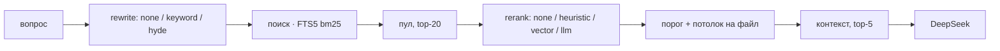

# day23 — второй этап: переписывание, реранкинг и сравнение режимов

Установка, ключи и команды запуска — в [корневом README](../README.md).

[`day22`](../day22/README.md) достал из индекса ответ и показал, что на этом корпусе в поиск должна идти лексика. Здесь между поиском и промптом встаёт второй этап: вопрос можно переписать, а двадцать кандидатов — переставить и отсечь. Пять режимов отвечают на один и тот же вопрос одной и той же моделью; различается только то, какие выдержки попали в блок и попали ли вообще.

Сравнение режимов — простая часть дня. Сложной оказалась та, с которой он начинался: переписывание, на которое ставили, проиграло, а выиграл фильтр, который умеет читать.

## Главный вывод: фильтр поднимает выдачу, переписывание — нет

day22 закончился планом: «пять чанков выбираются по bm25, и проверять их не проверял никто». План выполнен. На тех же 119 эталонных отрывках, заданных вопросом:

**recall@5 — нужный чанк доехал до промпта:**

| Реранкер | `none` | `keyword` | `hyde` |
| --- | --- | --- | --- |
| `none` | 0.66 | 0.63 | 0.55 |
| `heuristic` | 0.60 | 0.60 | 0.54 |
| `vector` | 0.43 | 0.39 | 0.41 |
| `llm` | **0.80** | **0.81** | 0.77 |

Точка отсчёта — `none`/`none`, буквальный day22: 0.66. LLM-реранкер поднимает её до 0.80, не трогая запрос. Keyword вместе с ним даёт лучшую клетку, 0.81, — плюс одна проба из 119. HyDE роняет и пул, и выдачу.

При этом контекст стал меньше, а не больше:

| Режим | recall@5 | MRR@5 | Выдержек | Файлов | Символов | Потеряно |
| --- | --- | --- | --- | --- | --- | --- |
| как в day22 | 0.66 | 0.49 | 5.00 | 3.69 | 4 617 | 0.22 |
| + keyword | 0.63 | 0.45 | 5.00 | 3.77 | 4 767 | 0.26 |
| + llm | **0.80** | **0.67** | **3.33** | 2.63 | 3 281 | **0.06** |
| + оба | **0.81** | 0.64 | 3.66 | 2.92 | 3 766 | 0.05 |

«Потеряно» — доля проб, где нужный чанк в пуле из двадцати был, а до промпта не доехал. У day22 это 0.22: ответ стоит шестым или двенадцатым, и top-5 его не видит. LLM достаёт почти всех: 0.06. Эвристика и вектор делают наоборот — выбрасывают тех, кого надо было оставить.

Поэтому под RAG здесь стоят `keyword` и `llm`. `hyde`, `heuristic` и `vector` остались в коде и на странице: вывод нужно было получить, и он нужен рядом с числами, а не вместо них.

## Почему HyDE проиграл своей же пробе

В day21 отрывок находил свой чанк в 84 случаях из ста, вопрос про тот же отрывок — в 23. HyDE должен был закрыть этот разрыв: модель пишет гипотетический абзац, и искать идут по нему — как по той самой пробе, которая дала 0.84.

На деле пул падает с 0.85 до 0.81, а recall@5 без фильтра — с 0.66 до 0.55. Причина видна в кэше. Вопрос «на каком порту слушает хранилище» модель переписывает так:

```
В day20 постоянный MCP-сервер хранилища (mcp_server.py) слушает на порту 8765
по HTTP. Подключение — MCPClient с base_url="http://localhost:8765".
```

Верного порта в выдержке нет, зато есть 8765 — порт `day18`. Лексика ищет уже его. На вопросах вне базы ещё яснее: лицензии в корпусе нет, а HyDE уверенно пишет MIT; облака нет — пишет Yandex Cloud и «4 200 ₽ в месяц». Для полнотекстового поиска выдуманное имя — это не нейтральный шум, а чужой терм, который уводит выдачу.

Keyword честнее: он остаётся на стороне вопроса и не придумывает чисел. Сам по себе он чуть слабее исходной формулировки (0.63 против 0.66) — редкое слово вопроса bm25 и так поднимает. Вместе с фильтром он всё же даёт лучшую клетку, потому что в пул иногда доезжает имя вроде `vault` или `start_char`, которого в вопросе не было.

## Два top-K и зачем их разводить

В day22 искали пять и брали пять. Фильтровать из пяти значило бы приносить в контекст три выдержки и выдавать обеднение за улучшение. Поэтому поиск достаёт **20** кандидатов, а в промпт едет не больше **5**.

Потолок режима — доля проб, где нужный чанк вообще попал в эти двадцать, — 0.85. Выше фильтр прыгнуть не может: того, чего нет в пуле, не переставишь. LLM закрывает почти весь зазор между 0.66 и 0.85. Остальные 15 проб поиск не нашёл, и это уже не про второй этап.



Пять режимов отличаются только конфигурацией этого конвейера. Промпт, модель, температура и три правила у всех одни — иначе сравнение мерило бы разницу промптов.

## Как выбирали порог

У каждого реранкера своя шкала, и одним числом тут не обойтись. Развертка на 119 пробах, исходный вопрос, оценки из кэша — меняется только отсечка.

**Эвристика** (bm25 к лучшему в пуле). Recall@5 держится на 0.60 до порога 0.67 и начинает падать на 0.70. Берём 0.65: контекст с 4 653 символов сжимается до 3 436, и ни одна проба за это не заплачена. Садиться ровно на обрыв незачем — bm25 зависит от числа термов, и у другого вопроса излом сдвинется.

**Вектор** (косинус на `model2vec`). Выше 0.40 recall@5 обваливается с 0.43 до 0.34, на 0.60 от выдачи остаётся 0.36 выдержки из пяти. Рабочей точки нет: 0.35 — это «почти не фильтруй». Day22 измерил вектор как плохой ретривер по 2 229 чанкам; здесь ему надо было упорядочить двадцать, и это тоже не вышло. Статические эмбеддинги не отличают «про тот же модуль» от «отвечает на вопрос».

**LLM** (оценка 0–3, один вызов на пул). Шкала дискретная, поэтому порог 2/3 означает ровно «оценка 2 и выше». Всё от 0.35 до 0.67 даёт одно и то же: recall@5 0.80 при 3.33 выдержках. Строже — только «оценка 3», и это 2.06 выдержки при 0.78: минус две пробы за минус 38% контекста, обмен спорный.

Потолок в две выдержки на файл ставится только там, где есть что фильтровать. Режим без реранкера обязан остаться буквальным day22, иначе точка отсчёта поедет.

## Контрольный набор: те же десять вопросов

Набор перенесён из [day22/questions.json](../day22/questions.json) без правок. Иначе «стало лучше» нельзя предъявить: сравнивали бы разные линейки. Папка day22 из корпуса исключена — в её README все десять вопросов разобраны вместе с ответами, и поиск находил бы шпаргалку.

| Режим | Факты | Источник найден | Точность контекста | Ответ сослался | Судья, 0–2 | На 2 балла | Отказы «вне базы» | Выдержек | Токенов запроса |
| --- | --- | --- | --- | --- | --- | --- | --- | --- | --- |
| без RAG | 0.26 | 0.00 | — | 0.00 | 1.00 | 4 из 10 | 2 из 2 | — | 124 |
| RAG как в day22 | 0.81 | 1.00 | 0.78 | 0.88 | 1.50 | 6 из 10 | 2 из 2 | 5.00 | 1 742 |
| + переписывание | 0.88 | 0.88 | 0.65 | 0.88 | 1.70 | 7 из 10 | 2 из 2 | 5.00 | 1 952 |
| + фильтр | 0.81 | 0.88 | 0.77 | 0.88 | 1.60 | 7 из 10 | 2 из 2 | **2.70** | **1 179** |
| + оба | **1.00** | **1.00** | 0.73 | **1.00** | **1.70** | 7 из 10 | 2 из 2 | 3.10 | 1 557 |

Фильтр на фактах не выигрывает у day22 — оба 0.81, — но режет контекст почти вдвое: 2.70 выдержки вместо пяти, 1 179 токенов запроса вместо 1 742. Вместе с переписыванием факты доходят до 1.00, и ответ ссылается на ожидаемый файл во всех восьми случаях, где источник вообще есть.

По типам вопросов судья видит то же, что в day22, только разложенное:

| Тип | Вопросов | без RAG | как в day22 | + rewrite | + фильтр | + оба |
| --- | --- | --- | --- | --- | --- | --- |
| `в базе` | 6 | 0.33 | 1.67 | **1.83** | **1.83** | **1.83** |
| `общий` | 2 | **2.00** | 0.50 | 1.00 | 0.50 | 1.00 |
| `вне базы` | 2 | 2.00 | 2.00 | 2.00 | 2.00 | 2.00 |

На вопросах из базы все три улучшенных режима получают 1.83 против 1.67 у day22. Разница — один вопрос, и он как раз про порт хранилища: без фильтра судья ставит 1, с фильтром — 2. На общих по-прежнему дороже эрудиция: строгое правило «отвечай только по выдержкам» не лечится ни переписыванием, ни отсевом. На вопросах вне базы — пять отказов из пяти, ничья, и это хороший результат: пустой или нерелевантный контекст не спровоцировал пересказ ближайшего.

Точность контекста — колонка, которой в day22 не было. «Источник найден» остаётся единицей, если нужный файл просто есть в выдаче. Точность считает долю выдержек из файлов, по которым на вопрос можно ответить. На вопросе про порт day22 приносил пять чанков из `vault.py`, и четыре из них были про подписи и журнал: источник найден, четыре пятых контекста оплачены зря.

## Прогон из терминала

```
$ python day23/scenarios.py ask "На каком порту слушает постоянный MCP-сервер хранилища в day20?"
## Вопрос: «На каком порту слушает постоянный MCP-сервер хранилища в day20?»

### без RAG

В day20 постоянный MCP-сервер хранилища слушает порт **8765** (HTTP/SSE-эндпоинт
на localhost). Точное значение стоит сверить в конфиге запуска сервера…

### RAG как в day22

Пул 20 → 5 выдержек, 1 файл

  [1] day20/servers/vault.py · модуль · часть 1
  [2] day20/servers/vault.py · def verify · часть 2
  [3] day20/servers/vault.py · def _db + def _digest
  [4] day20/servers/vault.py · def _inside
  [5] day20/servers/vault.py · def journal_list

На порту 8770 [1].

### + фильтр

Пул 20 → 5 выдержек, 4 файла, оценка 1.00 у каждой дошедшей

  [1] day20/servers/vault.py · модуль · часть 1
  [2] day20/servers/vault.py · def verify · часть 2
  [3] README.md · Запуск · часть 2
  [4] day20/registry.py · class Server · часть 2
  [5] day20/README.md · Три сервера, три роли, два транспорта · часть 2

Постоянный MCP-сервер хранилища слушает на порту 8770 [1][4].
Адрес — http://127.0.0.1:8770/mcp [3].
```

Без RAG уверенно врёт порт day18. С RAG как в day22 отвечает верно, но все пять выдержек — из одного файла, и четыре из них про другое. Фильтр оставляет модуль с портом и подтягивает README и реестр; ответ называет не только 8770, но и адрес.

Шаги разделены по тому, что им нужно. `build`, `check`, `matrix` и `sweep` после прогрева кэшей работают без ключа. Ключ нужен `rewrite`, `rerank`, `ask` и `questions` — и первому прогону матрицы, пока оценки LLM-реранкера не лежат в [relevance.json](relevance.json).

```bash
python day23/scenarios.py                 # корпус, индекс, сверка, матрица, набор
python day23/scenarios.py matrix          # 3 переписывания × 4 реранкера на 119 пробах
python day23/scenarios.py sweep           # развертка по порогу, без сети если кэш тёплый
python day23/scenarios.py ask "вопрос"    # один вопрос в пяти режимах
python day23/scenarios.py questions       # десять вопросов в пяти режимах и оценки
```

Переписывание и реранкер переключаются флагами: `python day23/scenarios.py questions --rewriter hyde --reranker heuristic`.

## Цена этапов

| | без RAG | как в day22 | + rewrite | + фильтр | + оба |
| --- | --- | --- | --- | --- | --- |
| Токенов на этапы | 0 | 0 | 277 | 0* | 277 |
| Токенов запроса | 124 | 1 742 | 1 675 | 1 179 | 1 280 |
| Токенов ответа | 77 | 68 | 69 | 76 | 81 |
| Секунд на этапы | 0 | 0.02 | 1.36 | 0.02 | 1.36 |
| Секунд ответа | 1.21 | 1.03 | 1.05 | 1.14 | 1.26 |

Keyword стоит ~280 токенов и секунду с небольшим: один короткий вызов до поиска. LLM-реранкер на новом вопросе — около шести тысяч токенов запроса: двадцать выдержек в одном вызове. В таблице у фильтра нули, потому что оценки уже лежат в кэше; без него этих чисел на контрольном наборе не было бы вовсе, и каждый прогон стоил бы сотни вызовов. Поэтому [rewrites.json](rewrites.json) и [relevance.json](relevance.json) коммитятся.

Поиск по-прежнему бесплатен на фоне модели: десятки миллисекунд против секунды ответа.

## Корпус без шпаргалки

| Источник | Файлов | Символов | Страниц |
| --- | --- | --- | --- |
| документация | 42 | 312 896 | 174 |
| код | 143 | 1 538 008 | 854 |
| **всего** | **185** | **1 850 904** | **1028** |

Из корпуса выброшены две папки. Своя — потому что докстринги модулей пересказывают принятые решения числами. day22 — потому что его README разбирает все десять контрольных вопросов вместе с ответами. Множество документов совпало с корпусом day22, поэтому 0.66 в клетке `none`/`none` — это та же линейка, а не новая.

| Чанков | Медиана, ток. | p95 | Макс. | Чанкинг | Эмбеддинг | FTS5 | Векторы |
| --- | --- | --- | --- | --- | --- | --- | --- |
| 2 229 | 261 | 401 | 402 | 5.3 с | 0.3 с | 0.03 с | 2.28 МБ |

Потолок FTS5 поднят с 24 термов до 64, и повторы схлопываются: гипотетический ответ — абзац, и без этого потолок уходил бы на одно и то же слово.

## Страница

Пять ответов пишутся одним потоком. Под ними — панель контекста на каждый режим: что дошло, что отсеяно, оценка, место в поиске и причина («ниже порога», «потолок на файл», «не вошёл в top-K»). Без отсеянного фильтр остаётся чёрным ящиком.

Ниже — контрольный набор, матрица 3×4 и развертка по порогу. Матрица и развертка после прогрева кэшей считаются на машине; ключ нужен вопросу и прогону набора.

## Файлы

| Файл | Что в нём |
| --- | --- |
| [corpus.py](corpus.py) | сбор корпуса; из него исключены day22 и day23 |
| [chunking.py](chunking.py) | структура с потолком и полом — как в day22 |
| [embed.py](embed.py) | `model2vec`: ленивая загрузка, батчи, нормировка L2 |
| [index.py](index.py) | схема `index.db`, FTS5, 64 терма с дедупликацией |
| [retrieve.py](retrieve.py) | три ретривера; под RAG по-прежнему лексика |
| [rewrite.py](rewrite.py) | три режима переписывания и кэш в `rewrites.json` |
| [rerank.py](rerank.py) | четыре реранкера в шкале 0..1, порог, потолок, кэш оценок |
| [pipeline.py](pipeline.py) | `Plan`: rewrite → retrieve → rerank → filter → контекст |
| [probes.py](probes.py) | матрица 3×4 и развертка по порогу на 119 пробах |
| [answer.py](answer.py) | пять режимов, общий промпт и температура |
| [evaluate.py](evaluate.py) | контрольный набор: механика, точность контекста, судья |
| [llm.py](llm.py) | DeepSeek: стрим для страницы, один вызов для прогонов |
| [scenarios.py](scenarios.py) | CLI: матрица, развертка, вопрос, набор — сразу в markdown |
| [main.py](main.py) | веб-слой: пять режимов одним потоком, ручки этапов |
| [static/](static/) | страница: пять ответов, дошло / отсеяно, матрица, развертка |
| [questions.json](questions.json) | 10 контрольных вопросов day22, без правок |
| [probes.json](probes.json) | 120 проб day21 — перенесены как есть |
| [rewrites.json](rewrites.json) | кэш переписанных запросов, коммитится |
| [relevance.json](relevance.json) | кэш оценок LLM-реранкера, коммитится |

`index.db` и PDF из `corpus/` в git не попадают.

## API

| Метод | Путь | Зачем |
| --- | --- | --- |
| `GET` | `/api/state` | корпус, индекс, ручки конвейера, набор проб и контрольный набор |
| `POST` | `/api/build` | сборка индекса потоком |
| `POST` | `/api/ask` | вопрос во всех пяти режимах, одним потоком |
| `POST` | `/api/rewrite` | один вопрос тремя режимами переписывания |
| `POST` | `/api/rerank` | один вопрос всеми реранкерами: пул, оценки, что отсеяно |
| `GET` | `/api/chunk/{id}` | чанк целиком: текст, метаданные, соседи |
| `POST` | `/api/matrix` | матрица 3×4 на пробах; без ключа, если кэш тёплый |
| `POST` | `/api/sweep` | развертка по порогу |
| `POST` | `/api/questions` | контрольный набор в пяти режимах — самая дорогая ручка |

## Что дальше

Упираться в четвёртый реранкер больше незачем: на этом корпусе релевантность считает модель, а не косинус и не нормированный bm25. Следующий шаг — не более умный поиск, а то, чего второй этап не закрыл. Пятнадцать проб из ста нужный чанк не попадает даже в двадцать кандидатов, и фильтр тут бессилен. И общее знание по-прежнему спорит со строгим правилом: на вопросе, который модель знает и так, RAG отвечает хуже. Это уже не про выдачу.
