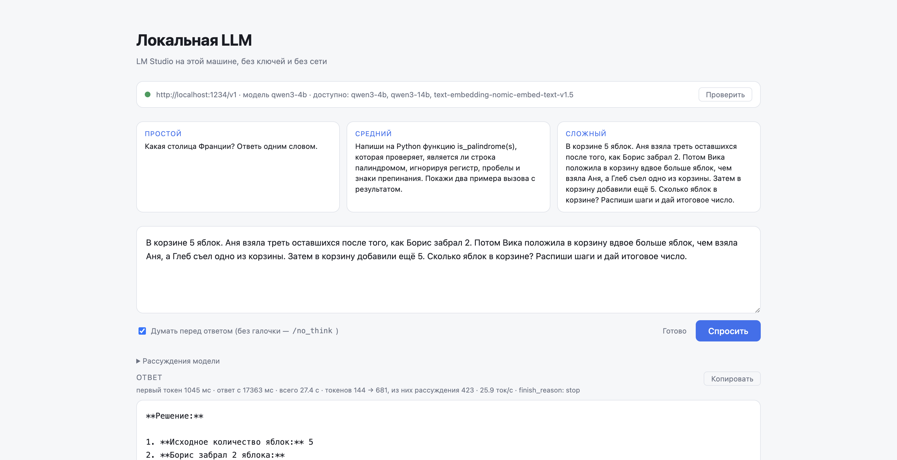

# day27 — веб-приложение на локальной LLM: LM Studio и qwen3-4b

Установка и общие команды запуска — в [корневом README](../README.md). Ключи в этом дне не нужны: модель работает на этой машине.

Приложение дня — веб-страница на FastAPI из day26, перенесённая без изменений в коде: она уже делает всё, что требует задание.

| Условие задания | Где в коде |
| --- | --- |
| отправляет запросы в локальную LLM | страница шлёт `POST /api/ask` ([main.py](main.py)), оттуда `llm.stream_answer` ([llm.py](llm.py)) идёт в LM Studio на `http://localhost:1234/v1` |
| получает и отображает ответы | ответ приходит стримом `text/event-stream`, [static/app.js](static/app.js) дописывает его на страницу по мере генерации, рассуждения — отдельным блоком |
| работает без облачных моделей | `base_url` указывает на localhost, ключ — заглушка `lm-studio`, переменные `DEEPSEEK_*` и `OPENROUTER_*` не читаются; плашка статуса проверяет `GET /v1/models` у LM Studio |

До сих пор каждый запрос уходил в DeepSeek по сети. Здесь та же форма — FastAPI, стрим, `AsyncOpenAI` — но адрес другой: `http://localhost:1234/v1`, сервер LM Studio, а за ним `qwen3-4b` (4 млрд параметров, 2.5 ГБ на диске). Код клиента от этого почти не меняется: LM Studio отдаёт API, совместимый с OpenAI, и `base_url` — единственное, что пришлось поменять. Ключ сервер не проверяет, SDK получает строку-заглушку.

## Главный вывод: модель отвечает правильно, но думает там, где не нужно

Все три запроса получили ответ, задача на арифметику решена верно в обоих режимах. Самое заметное — цена рассуждений. Qwen3 по умолчанию сначала думает, и на вопросе «столица Франции одним словом» это 132 токена рассуждений ради 8 токенов ответа: 5.6 с вместо 0.3 с. На запросе с кодом рассуждения заняли 1682 токена и почти минуту, а ответ при этом не стал лучше.

## Проверка: модель локальная и доступна

```bash
lms server start            # Success! Server is now running on port 1234
lms ps                      # qwen3-4b  IDLE  2.50 GB  context 40960  Local
curl http://localhost:1234/v1/models
curl http://localhost:1234/v1/chat/completions -H 'Content-Type: application/json' \
  -d '{"model":"qwen3-4b","messages":[{"role":"user","content":"Столица Франции? Ответь одним словом. /no_think"}]}'
```

Последний вызов возвращает `"content": "Париж."` и `usage` с `prompt_tokens: 27, completion_tokens: 9`. Это и есть простой запрос из задания, сделанный голым HTTP без единой строки Python.

## Три запроса разной сложности

Запросы лежат в [prompts.py](prompts.py). Сложность растёт не длиной вопроса, а объёмом работы до ответа: вспомнить слово, написать функцию, удержать цепочку из пяти условий. Каждый запрос ушёл дважды: с рассуждением и с маркером `/no_think` — штатным переключателем Qwen3.

`python day27/scenarios.py`, Apple M4, `qwen3-4b`:

| Запрос | Режим | Первый токен | Начало ответа | Всего | Токенов ответа | Из них рассуждения | Ток/с | finish_reason |
| --- | --- | --- | --- | --- | --- | --- | --- | --- |
| простой | думает | 1339 мс | 5446 мс | 5.6 с | 140 | 132 | 33.1 | stop |
| простой | /no_think | 241 мс | 241 мс | 0.3 с | 8 | 0 | 85.6 | stop |
| средний | думает | 259 мс | 55785 мс | 64.9 с | 1942 | 1682 | 30.1 | stop |
| средний | /no_think | 403 мс | 403 мс | 4.6 с | 138 | 0 | 32.6 | stop |
| сложный | думает | 447 мс | 14741 мс | 22.2 с | 677 | 446 | 31.1 | stop |
| сложный | /no_think | 278 мс | 278 мс | 10.8 с | 337 | 0 | 32.0 | stop |

«Первый токен» — когда пришло хоть что-то, рассуждение или ответ; «начало ответа» — когда пошёл сам ответ. В режиме рассуждения между ними и лежит вся цена размышлений: пользователь видит пустой экран, а модель в это время пишет себе черновик.

**Простой — «Какая столица Франции? Ответь одним словом».** Оба режима: «Париж». Рассуждение здесь бесполезно и обходится в 18 раз дороже по времени. Скорость 85 ток/с у `/no_think` — артефакт восьми токенов, где загрузка промпта занимает большую часть времени; честная скорость генерации у 4B на этой машине — около 30 ток/с.

**Средний — функция `is_palindrome`.** Оба режима выдали рабочий по виду код с регуляркой и двумя примерами на английском. И оба ошиблись одинаково: фильтр `[^a-z]` (или `[^a-zA-Z0-9]`) выкидывает кириллицу, поэтому на «А роза упала на лапу Азора» функция вернёт `True` случайно — от строки остаётся пустая, а пустая строка палиндром. Любая русская фраза тоже окажется палиндромом. 1682 токена рассуждений этого не поймали, а в пояснении к коду модель ещё и написала, что сравниваются «первая и вторая половины строки», хотя код сравнивает строку с её разворотом. Для 4B-модели это предел: синтаксически код верный, а вот проверить его на языке вопроса модель не догадалась.

**Сложный — яблоки в корзине.** Оба режима: 5 − 2 = 3, Аня взяла 1, осталось 2, Вика +2 → 4, Глеб −1 → 3, +5 → **8**. Верно. Здесь рассуждение хотя бы не мешает, но и не нужно: задача линейная, и без `/no_think` модель всё равно расписывает шаги в самом ответе, потому что этого просит промпт. Рассуждение просто дублирует решение вдвое дороже.

## Веб-интерфейс



```bash
lms server start
uvicorn main:app --reload --app-dir day27
```

Плашка сверху опрашивает `GET /v1/models` у LM Studio: зелёная точка, если сервер отвечает и модель из `LMSTUDIO_MODEL` есть в списке; красная с подсказкой `lms server start`, если нет. Три карточки — те же три запроса, клик отправляет запрос сразу. Галочка «думать» управляет `/no_think`. Рассуждения приходят отдельным потоком и сворачиваются в блок над ответом; под заголовком ответа — те же метрики, что в таблице, а под ответом — ожидаемый результат для готовых запросов.

## Рассуждения: два формата

LM Studio отдаёт рассуждения Qwen3 отдельным полем `delta.reasoning_content`. Если в настройках модели разделение выключено, они приходят прямо в `content` внутри `<think>...</think>`. [llm.py](llm.py) сводит оба случая к одному потоку событий — `Delta(reasoning, content)` и финальный `Done` с метриками, — так что страница и терминальный прогон не знают, в каком формате ответил сервер. Токены берутся из `usage` через `stream_options={"include_usage": true}`; `reasoning_tokens` LM Studio считает сам.

## Настройка

Переменные необязательны, значения по умолчанию подходят для LM Studio как есть:

```
LMSTUDIO_BASE_URL=http://localhost:1234/v1
LMSTUDIO_MODEL=qwen3-4b
```

`LMSTUDIO_MODEL=qwen3-14b` переключает день на старшую модель без правки кода.

| Файл | Назначение |
| --- | --- |
| `day27/main.py` | FastAPI: `/`, `GET /api/status`, `GET /api/prompts`, `POST /api/ask` |
| `day27/llm.py` | Клиент LM Studio, разделение рассуждений и ответа, замеры |
| `day27/prompts.py` | Три запроса разной сложности с ожидаемым ответом |
| `day27/scenarios.py` | Прогон трёх запросов в двух режимах, вывод в markdown |
| `day27/static/` | Страница: статус сервера, готовые запросы, ответ и рассуждения |

## API

`POST /api/ask` принимает `{"prompt": "...", "think": true}` и отдаёт `text/event-stream`: кадры `event: reasoning` с частями рассуждений, кадры `data: <json-строка>` с частями ответа, затем `event: done` с `{finish_reason, ttft_ms, answer_ms, total_ms, prompt_tokens, completion_tokens, reasoning_tokens, tokens_per_sec}` либо `event: error`.

`GET /api/status` возвращает `{online, base_url, model, models, model_available}`, а если LM Studio не отвечает — `{online: false, error}`.

## Известная мелочь

На Python 3.14 связка `openai` 3.6 и `httpcore2` печатает в stderr `RuntimeError: generator didn't stop after athrow()` при закрытии стрима. Это воспроизводится на десяти строках голого SDK без кода дня и на ответы не влияет: markdown прогона идёт в stdout, и `python day27/scenarios.py > report.md` даёт чистый файл.
